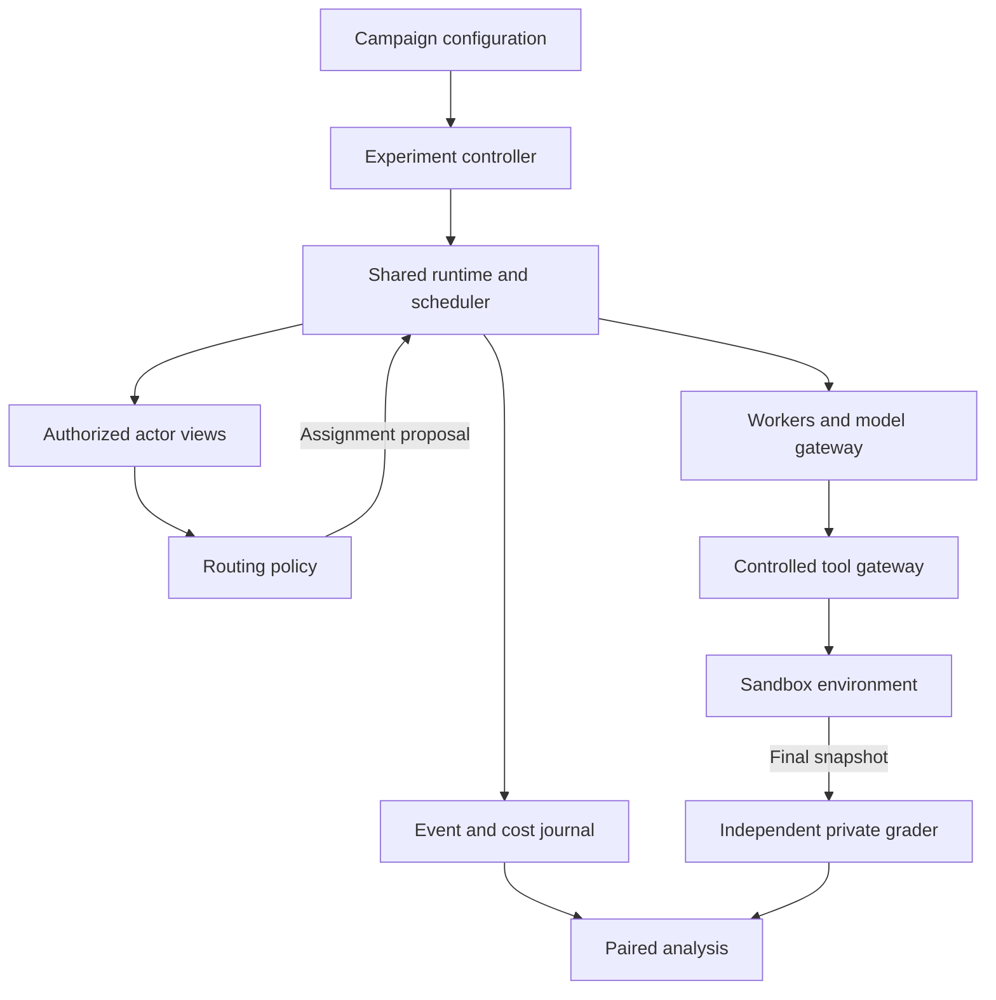

# Tweetflows

**Adaptive coordination for AI agents**

Tweetflows is a research project on budget-aware agent discovery, referral, and coordination under partial visibility and changing availability. It revisits the ideas of [Tweetflows — Flexible Workflows with Twitter (2011)](https://dsg.tuwien.ac.at/team/dschall/papers/2011_tweetflows.pdf) in the context of contemporary AI agents. A Twitter/X integration is outside the planned prototype.

## Status

The prototype now validates, plans, and executes controlled agent tasks, with discovery, delegation, tool use, persistent budgets, and independent grading. Deterministic fixture runs are tested; an opt-in live model adapter is available. WorkBench integration and the scientific evaluation are still pending.

The README is in English; the research documents and implementation specification are in German.

## Try the planner

Install [uv](https://docs.astral.sh/uv/getting-started/installation/), then run from the repository root:

```sh
uv sync --locked
uv run --locked agentflow validate configs/fixture-smoke.json
uv run --locked agentflow plan configs/fixture-smoke.json --output plan.json
uv run --locked pytest
```

The project pins Python 3.12.12 in `.python-version` and dependencies in `uv.lock`. The first installation may download Python and packages. Validation and planning themselves run offline and need no credentials.

`plan` produces 72 episode descriptions in 24 comparison groups. Each group shares scenario seeds and infrastructure settings across the three methods. Existing output files are never overwritten. Omit `--output` to emit JSON to standard output.

Run the deterministic execution campaign:

```sh
uv run --locked agentflow run configs/fixture-smoke.json --output artifacts/fixture-001
```

Add `--resume` to continue that output directory. The execution manifest records the prototype profile and worker identity. For live model settings, output files, recovery behavior, and research limitations, see the [execution guide](docs/execution.md). `plan` itself remains an offline design artifact, not a main-study execution manifest.

## Research question

Can selective referrals improve independently verified task completion within a fixed budget when agents have incomplete knowledge of available capabilities, discover additional requirements during execution, and encounter unavailable collaborators?

The planned study compares three routing policies on shared execution infrastructure:

| Policy | Approach |
|---|---|
| `central_active_v1` | A central coordinator actively discovers candidates and aggregates legitimately acquired information and history. |
| `intent_local_v1` | Local discovery using intent subscriptions; explicitly a RAPS-inspired adaptation. |
| `referral_local_v1` | Selective referrals through local contacts, with bounded search and separate execution and referral history. |

All policies use the same workers, tool permissions, information-access rules, cost accounting, and evaluation components. The study investigates the conditions under which referrals help; it does not assume they outperform the baselines.

## Documentation

| Document | Contents |
|---|---|
| [Research report](docs/research.md) | Literature review, critique of the original work, related work, and research gaps. |
| [Paper proposal](docs/expose.md) | Research questions, hypotheses, experimental design, and proposed contributions. |
| [Technical specification](docs/specification.md) | Architecture, contracts, state transitions, routing policies, budgets, and 24 acceptance criteria. |
| [Fixture campaign](configs/fixture-smoke.json) | Example configuration for 72 planned deterministic episodes without external model calls. |
| [Execution guide](docs/execution.md) | Runnable fixtures, live model setup, persistence, accounting, and known limits. |
| [Planning contract](docs/planning.md) | Supported configuration, identifiers, budget interpretation, and reproducibility boundaries. |
| [WorkBench audit](docs/workbench-provenance.md) | Pinned upstream source inspection and remaining adapter acceptance requirements. |

For implementation, start with the technical specification. Its requirements are normative for the prototype; the other documents explain the scientific motivation and evaluation plan.

## Planned architecture

The first prototype targets Python 3.12, a local command-line interface, eight agents, and one SQLite database per episode. A shared runtime controls assignment, execution, budgets, and recovery. Routers and workers receive only authorized views of the environment.



Operational verification during execution is separate from the private grader used after an episode. The primary outcome is independently verified goal completion within the budget and deadline, without forbidden effects.

Deterministic fixtures come first, followed by a WorkBench adapter subject to compatibility and provenance checks. The local scheduler is experimental infrastructure; local referral decisions do not imply a fully decentralized deployment.

## Implementation roadmap

An executable engineering slice spans M1–M5: task execution, local discovery, delegation, model transport, persistence, and exports. Full message contracts, asynchronous transport, benchmark integration, and research-grade accounting/evaluation remain open; milestone completion is tracked against the specification, not inferred from fixture success.

| Milestone | Deliverable |
|---|---|
| M0 — Contracts and provenance | Dependency lockfile, JSON schemas, resolved configuration, and benchmark compatibility checks. |
| M1 — Runtime | Task state machine, transactional journal, budgets, controlled effects, recovery, and virtual time. |
| M2 — Visibility and discovery | Actor isolation, observation provenance, contact API, and reproducible scenario seeds. |
| M3 — Routing policies | Three main policies, diagnostic variants, and deterministic reference traces. |
| M4 — Benchmarks and models | Benchmark adapter, model gateway, operational checks, and private grader. |
| M5 — Experiment tooling | Campaign planning, resume, exports, paired comparisons, and statistical analysis. |
| M6 — Pilot | Development-task runs, cost and grader audits, and a frozen main-study configuration. |

Detailed dependencies and acceptance criteria are in the [specification](docs/specification.md). The example campaign defines 3 policies × 2 tasks × 4 regimes × 3 seeds = **72 episodes**. Planning and selected execution/failure contracts have automated coverage. The campaign executes synthetic tasks and uses experimental credits; it is not a research benchmark result.

## Origins and scope

The original Tweetflows paper by Martin Treiber, Daniel Schall, Schahram Dustdar, and Christian Scherling explored lightweight workflow coordination through social-network messages. This project investigates how those ideas transfer to agent discovery and delegation, alongside established work on Contract Net, referral networks, and contemporary multi-agent coordination.

The proposed contribution is an evaluated integration under explicit information and resource constraints. Pub/sub, reputation, and referral mechanisms themselves are established ideas; see the [research report](docs/research.md) for attribution and limitations.

## License

This repository is licensed under the [MIT License](LICENSE). Referenced papers and external datasets retain their respective licenses.
