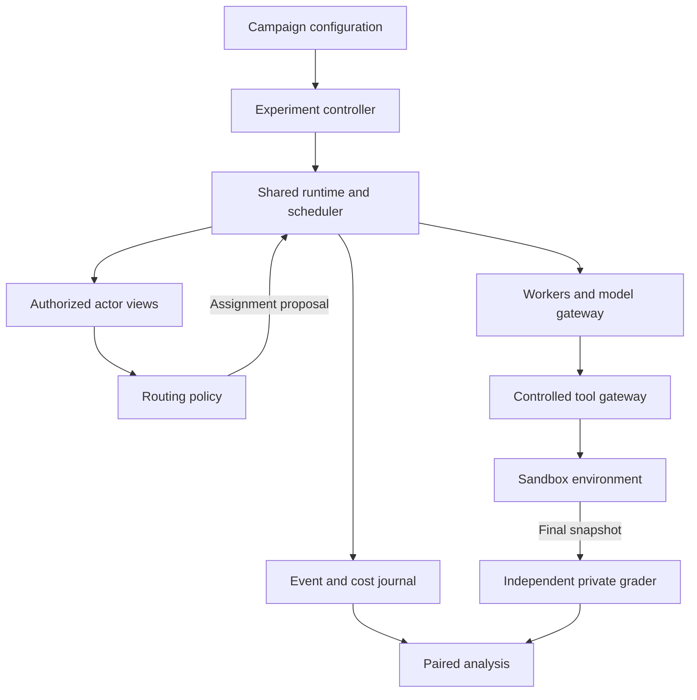

# Tweetflows

**Adaptive coordination for AI agents**

Tweetflows is a research project on budget-aware agent discovery, referral, and coordination under partial visibility and changing availability. It revisits the ideas of [Tweetflows — Flexible Workflows with Twitter (2011)](https://dsg.tuwien.ac.at/team/dschall/papers/2011_tweetflows.pdf) in the context of contemporary AI agents. A Twitter/X integration is outside the planned prototype.

## Status

This repository currently contains the research report, paper proposal, technical specification, and an example experiment configuration. The runtime, command-line interface, benchmark adapters, and tests have **not yet been implemented**. No experimental results are available.

The README is in English; the research documents and implementation specification are in German.

## Research question

Can selective referrals improve independently verified task completion within a fixed budget when agents have incomplete knowledge of available capabilities, discover additional requirements during execution, and encounter unavailable collaborators?

The planned study compares three routing policies on shared execution infrastructure:

| Policy | Approach |
|---|---|
| `central_active_v1` | A central coordinator actively discovers candidates and aggregates legitimately acquired information and history. |
| `intent_local_v1` | Local discovery using intent subscriptions; explicitly a RAPS-inspired adaptation. |
| `referral_local_v1` | Selective referrals through local contacts, with bounded search and separate execution and referral history. |

All policies use the same workers, tool permissions, information-access rules, cost accounting, and evaluation components. The study investigates the conditions under which referrals help; it does not assume they outperform the baselines.

## Documentation

| Document | Contents |
|---|---|
| [Research report](docs/research.md) | Literature review, critique of the original work, related work, and research gaps. |
| [Paper proposal](docs/expose.md) | Research questions, hypotheses, experimental design, and proposed contributions. |
| [Technical specification](docs/specification.md) | Architecture, contracts, state transitions, routing policies, budgets, and 24 acceptance criteria. |
| [Fixture campaign](configs/fixture-smoke.json) | Example configuration for 72 planned deterministic episodes without external model calls. |

For implementation, start with the technical specification. Its requirements are normative for the prototype; the other documents explain the scientific motivation and evaluation plan.

## Planned architecture

The first prototype targets Python 3.12, a local command-line interface, eight agents, and one SQLite database per episode. A shared runtime controls assignment, execution, budgets, and recovery. Routers and workers receive only authorized views of the environment.

Operational verification during execution is separate from the private grader used after an episode. The primary outcome is independently verified goal completion within the budget and deadline, without forbidden effects.

Deterministic fixtures come first, followed by a WorkBench adapter subject to compatibility and provenance checks. The local scheduler is experimental infrastructure; local referral decisions do not imply a fully decentralized deployment.

## Implementation roadmap

All milestones below are planned.

| Milestone | Deliverable |
|---|---|
| M0 — Contracts and provenance | Dependency lockfile, JSON schemas, resolved configuration, and benchmark compatibility checks. |
| M1 — Runtime | Task state machine, transactional journal, budgets, controlled effects, recovery, and virtual time. |
| M2 — Visibility and discovery | Actor isolation, observation provenance, contact API, and reproducible scenario seeds. |
| M3 — Routing policies | Three main policies, diagnostic variants, and deterministic reference traces. |
| M4 — Benchmarks and models | Benchmark adapter, model gateway, operational checks, and private grader. |
| M5 — Experiment tooling | Campaign planning, resume, exports, paired comparisons, and statistical analysis. |
| M6 — Pilot | Development-task runs, cost and grader audits, and a frozen main-study configuration. |

Detailed dependencies and acceptance criteria are in the [specification](docs/specification.md). The example campaign defines 3 policies × 2 tasks × 4 regimes × 3 seeds = **72 episodes**. It uses synthetic credits and is not an executable benchmark yet.

## Origins and scope

The original Tweetflows paper by Martin Treiber, Daniel Schall, Schahram Dustdar, and Christian Scherling explored lightweight workflow coordination through social-network messages. This project investigates how those ideas transfer to agent discovery and delegation, alongside established work on Contract Net, referral networks, and contemporary multi-agent coordination.

The proposed contribution is an evaluated integration under explicit information and resource constraints. Pub/sub, reputation, and referral mechanisms themselves are established ideas; see the [research report](docs/research.md) for attribution and limitations.

## License

This repository is licensed under the [MIT License](LICENSE). Referenced papers and external datasets retain their respective licenses.
