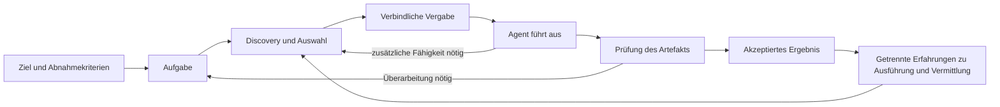

# Agentenkoordination durch selektive Vermittlung

## 1. Erkenntnisstand und wissenschaftliche Positionierung

Eine wissenschaftliche Weiterentwicklung von Tweetflows ist vor allem als empirische Untersuchung der Bedingungen sinnvoll, unter denen soziale Vermittlung zwischen LLM-Agenten einen messbaren Nutzen bietet. Als Untersuchungsgegenstand wird ein Netzwerk heterogener Agentendienste vorgeschlagen, dessen Fähigkeiten und aktuelle Verfügbarkeit den Beteiligten nur teilweise bekannt sind. Ein während der Bearbeitung sichtbar werdender Bedarf muss durch Suche, Empfehlung, Vergabe und überprüfbare Ausführung gedeckt werden.

Die tragfähigste Positionierung lautet: **budgetkontrollierte Untersuchung selektiver Agentenvermittlung bei partieller Fähigkeitssicht und wechselnder Verfügbarkeit**. Der angestrebte Beitrag besteht in einer präzisen Aufgabenstellung, einer nachvollziehbaren Integration bekannter Mechanismen und einer Evaluation ihrer Wechselwirkungen. Eine bessere Leistung ist eine zu prüfende Hypothese.

Die wesentlichen Einzelideen besitzen Vorarbeiten: auftragsbezogene Vergabe im Contract Net, erfahrungsbasierte Empfehlungen in Referral Networks, adaptive Nachrichtenvermittlung in RAPS und dezentrale Agentenauswahl in AgentNet. Auch Verpflichtungssemantik und durchsetzbare Ausführungsgrenzen sind etablierte Forschungsgebiete. Aus dieser Literatur ergibt sich eine begrenzte Neuheitsperspektive: Die vorgeschlagene Kombination von Informationsbedingungen, zeitlichen Störungen und unabhängig gemessenem Werkzeugerfolg sollte als offene empirische Frage behandelt werden.[^1][^2][^3][^4][^5]

## 2. Umfang und Evidenzbewertung

Der Literaturstand berücksichtigt zugängliche Primärquellen bis einschließlich **13. September 2026**. Er verbindet klassische Forschung zu verteilten Agenten mit Arbeiten zu LLM-Systemen aus den Jahren 2023–2026 sowie offiziellen Protokolldokumenten. Die Auswahl folgt einer fokussierten, strukturierten Literaturrecherche mit gezielten Suchläufen und Prüfung einschlägiger Referenzen. Sie beansprucht keine vollständige bibliometrische Abdeckung und ist keine präregistrierte systematische Übersicht.

Eingeschlossen wurden Originalarbeiten oder offizielle Spezifikationen mit direktem Bezug zu mindestens einem der Bereiche Vermittlung, Vergabe, Informationssicht, Fehlerbehandlung, Verifikation oder Evaluation. Allgemeine Produktübersichten und Sekundärzusammenfassungen dienen nicht als Belege für technische Befunde. Leistungswerte werden nur innerhalb des jeweils berichteten Versuchsaufbaus interpretiert. Die Recherche umfasst keine unabhängige Replikation der Experimente.

Die Evidenz wird in vier Kategorien unterschieden: begutachtete Forschungsarbeiten, begutachtete Positions- oder Visionsbeiträge, noch nicht unabhängig als begutachtet bestätigte Preprints und normative technische Dokumentation. Ein Preprint kann eine Neuheitsbehauptung bereits einschränken; seine empirischen Ergebnisse besitzen dadurch noch keine unabhängig bestätigte Gültigkeit. Versionsangaben sind bei jüngeren Quellen wesentlich, weil sich Stichproben und Schlussfolgerungen zwischen Fassungen ändern können.

## 3. Historischer Ausgangspunkt

Tweetflows beschreibt kurze Kommunikationsprimitive für Dienstsuche, Übernahme, Delegation, Antwort und Beobachtung. Ein gemeinsamer Nachrichtenkanal verbindet Menschen und Software; soziale Beziehungen vermitteln zusätzliche Fähigkeiten. Der Beitrag liegt in der leichtgewichtigen Integration und im ad-hoc entstehenden Ablauf. Die Evaluation besteht aus einem Projektszenario und einzelnen Vermittlungsbeobachtungen. Verzweigungen, Synchronisation und Fristen werden als Erweiterungen angekündigt.[^6]

Für heutige Agentensysteme ist daran besonders interessant, dass benötigte Teilnehmer während der Arbeit gefunden werden können. Die Arbeit belegt jedoch weder einen Skalierungsvorteil noch zuverlässige automatische Ausführung. Auch sichtbare Nachrichten allein begründen keinen konsistenten, verbindlichen Aufgabenstatus. Diese Einschätzung betrifft die Reichweite der damaligen Evidenz; LLM-spezifische Fehler sind eine Erweiterung des Untersuchungsgegenstands.[^6]

Smiths Contract Net trennt Aufgabenankündigung, Angebote und Vergabe. Eignungskriterien und Fristen begrenzen die Kandidatenauswahl; FIPA präzisiert entsprechende Interaktionsfolgen. Diese Vorarbeiten sind Referenzen für die Vergabeschicht. Eine Auswahl durch den ersten antwortenden Agenten und eine Angebotsrunde sollten als unterschiedliche Kosten-Nutzen-Entscheidungen modelliert werden.[^1][^7]

Yolum und Singh untersuchen bereits selbstorganisierte Vermittlungsnetze, in denen fachliche Kompetenz und die Fähigkeit, geeignete andere Teilnehmer zu empfehlen, getrennt bewertet werden. Damit sind lokale Erfahrung, mehrstufige Empfehlungen und begrenzte Weiterleitung historische Vorarbeiten zum vorgeschlagenen Ansatz. Eine neue LLM-Arbeit muss den zusätzlichen Erkenntnisgewinn auf der Ebene ihrer Aufgaben, Messung und empirischen Grenzen begründen.[^2]

Tosca behandelt die Operationalisierung von Verpflichtungen über Informationsprotokolle und die Vereinbarkeit lokaler Schlussfolgerungen über Verpflichtungen. Daraus folgt für die Positionierung: Eine verbindliche Aufgabenübernahme sollte formal anschlussfähig sein, aber nicht als erstmals eingeführte Agentenverpflichtung dargestellt werden.[^3]

## 4. Engste aktuelle Vorarbeiten

| Arbeit | Relevanter Beitrag und Grenze | Konsequenz für das Vorhaben |
|---|---|---|
| RAPS, 2026 | Reputationsgestütztes Publish/Subscribe mit reaktiven Subscriptions. Der Broker verwendet einen globalen Subscription-Pool; die berichteten Tests variieren Populationsgröße und adversariale Teilnehmerzusammensetzung.[^4] | Direkter Vergleichskandidat. Zeitlich definierte Ausfälle und partielle Discovery müssen gesondert operationalisiert werden. |
| AgentNet, NeurIPS 2025 | Dezentrale Agentenauswahl mit Expertisebezug; der diskutierte Kandidatenraum bleibt begrenzt und vordefiniert.[^5] | Starke verwandte Architektur. Der Zugang zu unbekannten Diensten ist ein gesondertes Evaluationsmerkmal. |
| GoAgent, 2026 | Erzeugung von Kommunikationsstrukturen unter expliziter Berücksichtigung von Agentengruppen.[^8] | Ein adaptiver Kommunikationsgraph allein begründet keinen neuen Beitrag. |
| AgentReputation, 2026; FSE-IVR-Annahme laut Autoren | Kontextbezogene Reputation und Berücksichtigung der Stärke von Verifikation; konzeptioneller Rahmen.[^9] | Kontextabhängige Vertrauenswerte sind ebenfalls Vorarbeit. Leistungsnachweise müssen getrennt bewertet werden. |
| Usable Agent Discovery, 2026 | Simulation strukturierter und Gossip-basierter Suche unter Host-Ausfällen und wechselnder Einsatzbereitschaft von Agenten.[^10] | Discovery bei wechselnder Verfügbarkeit ist bereits direkter Forschungsgegenstand. Offen bleibt die hier vorgeschlagene Kopplung an vollständige LLM-Werkzeugaufgaben. |

*Usable Agent Discovery* macht einen zusätzlichen Abgrenzungspunkt sichtbar: Ein erreichbarer Dienst muss nicht rechtzeitig einsatzbereit sein. Der Vergleich von Kademlia und Cyclon+Vicinity liefert je nach Störungsart unterschiedliche Vorteile. Die berichtete Simulation begründet daher eine starke Discovery-Referenz, liefert aber keine Messung der Qualität tatsächlich erzeugter LLM-Artefakte.[^10]

AgentPrune untersucht die Entfernung wenig nützlicher Kommunikationsverbindungen aus bestehenden Agentensystemen. Für die geplante Studie ist es eine ergänzende Referenz zur Kommunikationsreduktion; eine vollständige Pruning-Replikation ist nur nötig, wenn genau diese Reduktion als neuer Mechanismus beansprucht wird.[^11]

Bei RAPS sollte die Abgrenzung präzise bleiben: Die beschriebenen Skalierungs- und Angriffsexperimente sind kein Nachweis für einen Versuch mit zeitlich injiziertem Ausfall nach verbindlicher Vergabe und anschließender Wiederaufnahme. Das ist eine Aussage über die berichteten Settings, nicht über eine prinzipielle Unfähigkeit der Architektur.[^4]

Eine lokale Adaption eines bestehenden Verfahrens verändert dessen Voraussetzungen. Sie muss deshalb mit eigenem Namen und dokumentierter Abweichung ausgewiesen werden. Sinnvoll sind zwei Vergleiche: eine möglichst originalgetreue Referenz unter deren Informationsbedingungen und ein gemeinsamer, kontrollierter Versuchsrahmen. Nur der zweite Vergleich isoliert die Auswirkungen einer Auswahlstrategie unter identischen Randbedingungen.

## 5. Befunde zu Zusammenarbeit, Fehlern und Kosten

Die Fehleranalyse MAST unterscheidet unter anderem Spezifikationsprobleme, Abstimmungsfehler und Fehler der Prüfung beziehungsweise Beendigung. Daraus folgt keine universelle Fehlerquote für Agentensysteme; die untersuchten Abläufe und Annotationen begrenzen die Übertragbarkeit. Für das Vorhaben eignet sich die Taxonomie zur strukturierten Nachanalyse fehlgeschlagener Versuche.[^12]

Die dritte Fassung von *Towards a Science of Scaling Agent Systems* berichtet 260 Konfigurationen über sechs Benchmarks. Der Zusammenhang zwischen Architektur und Aufgabentyp ist ausgeprägt; einzelne ursprüngliche Effekte werden in der überarbeiteten Analyse vorsichtiger interpretiert. Zahlen aus älteren Fassungen dürfen daher nicht als allgemeine Skalierungsgesetze übernommen werden. Insbesondere ergibt sich keine allgemeingültige Schwelle, ab der mehrere Agenten vorteilhaft sind.[^13]

Die kontrollierte Re-Evaluation von Zhang et al. zeigt, wie stark Aussagen über Effizienz von Ausgangstopologie, Rollen, Werkzeugzugriff und Vergleichskonfiguration abhängen können. Eine zufällig vereinfachte Struktur kann eine wichtige Kontrolle sein. Weniger Kommunikation ist deshalb erst dann ein Gewinn, wenn die für das Ziel nötige Arbeit weiterhin erbracht wird.[^14]

Tran und Kiela berichten für textbasiertes Multi-Hop-Reasoning vergleichbare oder bessere Einzelagentenleistung bei gleichen angeforderten Denkbudgets. Ihr Befund lässt sich nicht ohne Weiteres auf Werkzeugnetzwerke übertragen. Er begründet jedoch die Erfassung tatsächlich verbrauchter Rechenressourcen zusätzlich zu nominellen Budgeteinstellungen. *AI Agents That Matter* liefert dazu die grundsätzliche methodische Forderung, Kosten, einfache Baselines und getrennte Testdaten gemeinsam zu berücksichtigen.[^15][^16]

TeamBench untersucht unter anderem explizite Rollentrennung und werkzeugbezogene Zusammenarbeit. Die berichteten Fehlannahmen durch Prüferrollen zeigen, dass ein zusätzlicher Verifier selbst eine Fehlerquelle sein kann. Die Arbeit stützt die Trennung zwischen systeminternem Urteil und unabhängig ermittelter Zielerreichung; sie beweist keine grundsätzliche Nutzlosigkeit von Verifikation.[^17]

Die daraus abgeleitete Evaluationsregel lautet: Erfolg, Kosten und Beobachtbarkeit sind getrennte Größen. Ein vollständig protokollierter Ablauf kann falsch sein. Ein günstiger Ablauf kann unerledigte Teilaufgaben übergehen. Ein intern akzeptiertes Ergebnis kann an einem unabhängigen Prüfkriterium scheitern. Deshalb wird im vorgeschlagenen Versuch der Endzustand der Umgebung zum primären Bezugspunkt.

## 6. Präzise Forschungslücke

Innerhalb der geprüften Literatur bleibt folgende gemeinsame Untersuchung hinreichend offen, um ein begrenztes empirisches Vorhaben zu rechtfertigen:

> Unter welchen Informations- und Verfügbarkeitsbedingungen verbessert selektive, erfahrungsbasierte Vermittlung den unabhängig geprüften Erfolg von LLM-Agenten innerhalb eines festen Gesamtbudgets gegenüber zentraler Suche und intentbasierter Nachrichtenvermittlung?

Die Abgrenzung beruht auf vier kontrollierbaren Dimensionen: welche Fähigkeiten anfangs bekannt sind, welche zusätzlichen Informationen durch Kommunikation gewonnen werden können, wann Teilnehmer ausfallen oder verfügbar werden und ob das finale Werkzeugergebnis korrekt ist. Der Schwerpunkt liegt auf der Interaktion dieser Dimensionen. Vollständige Neuheit über die gesamte Literatur kann aus einer fokussierten Recherche nicht abgeleitet werden.

Der Begriff „sozial“ bezeichnet dabei einen aus beobachteter Zusammenarbeit und Empfehlungen abgeleiteten Graphen. Er setzt keine menschlichen Eigenschaften der Agenten voraus. Vermittlungskompetenz und Ausführungskompetenz werden getrennt erfasst: Ein Agent kann einen geeigneten Spezialisten kennen, ohne dessen Aufgabe selbst lösen zu können.

Ebenso sind drei Graphen zu unterscheiden. Der **Entdeckungsgraph** bestimmt, welche neuen Kandidaten ein Teilnehmer durch Kontakte finden kann. Der **Kommunikationsgraph** beschreibt die tatsächlich versendeten Nachrichten. Der **Aufgabengraph** enthält Abhängigkeiten zwischen Arbeitsleistungen. Eine Änderung des Kommunikationsgraphen allein beweist noch keine Entdeckung neuer Fähigkeiten oder Anpassung der Aufgabenstruktur.

## 7. Empfohlener technischer Untersuchungsrahmen

Der Prototyp sollte eine gemeinsame Ausführungsumgebung für alle verglichenen Strategien bereitstellen. Veränderlich sind die Suche nach Kandidaten und deren Auswahl; Aufgabenbeschreibung, Werkzeuge, Abnahme und Kostenmessung bleiben kontrolliert. Die Architektur ist logisch verteilt in der Auswahl, darf für den Versuch aber eine zentrale Aufgabenablage und einen gemeinsamen Nachrichtenvermittler nutzen. Aussagen über vollständige infrastrukturelle Dezentralität wären damit nicht gedeckt.

*Abbildung: vorgeschlagener Untersuchungsrahmen; keine Darstellung eines bereits implementierten Systems.*

Eine Aufgabe erhält Identität, Eingabeversion, erlaubte Aktionen, Budget und Abnahmekriterien. Ein Ausführungsversuch erhält eine eigene Versionsnummer. Die Laufzeit verwaltet mindestens die Zustände offen, vergeben, aktiv, eingereicht, akzeptiert, fehlgeschlagen und abgebrochen. Ablehnung einer Einreichung und Neuvergabe sind explizite Übergänge. Ein Systemsignal „fertig“ ersetzt die Abnahme nicht.

Zeitlich begrenzte Ausführungsrechte und eine Prüfung der aktuellen Berechtigung beim verbindlichen Schreiben sollen verspätete Änderungen nach Neuvergabe abweisen. Wiederholte Nachrichten werden anhand ihrer Identität behandelt. Solche Mechanismen stehen in der Tradition verlässlicher verteilter Infrastruktur; A2A liefert ergänzend Beschreibungen, Nachrichten, Aufgaben und Artefakte, aber keine automatische Garantie aller hier benötigten Semantiken.[^18][^19]

Neuere Preprints wie CapLease und SOUNDGATE behandeln dauerhaften Autorisierungszustand, Wiederholungen und die Durchsetzung von Abbruchgrenzen unmittelbar für Agenten. Sie begrenzen Neuheitsansprüche auf dieser Ebene zusätzlich. Ihre Garantien sind an die jeweils genannten Voraussetzungen gebunden, insbesondere an die Vermittlung aller relevanten Seiteneffekte und geeignete Zielsysteme.[^20][^21]

Mit AgentSpec besteht außerdem eine begutachtete Referenz für anpassbare Regeln zur Laufzeitdurchsetzung bei LLM-Agenten. Das technische Trennen von freier Planung und geprüfter Ausführung ist somit auch jenseits aktueller Preprints anschlussfähig.[^22]

Für die geplante Studie ist diese Technik eine gemeinsame Kontrollschicht. Eine eigene Variante darf nicht zugleich besseres Routing und eine exklusiv robustere Laufzeit erhalten. Ein separater Störfalltest kann den Nutzen der Schutzschicht messen, muss aber als eigene Fragestellung ausgewiesen werden. Bei unkontrollierten externen Systemen wird keine Garantie genau einmaliger Wirkung behauptet.

Die erste Vermittlungsstrategie sollte bewusst einfach sein: bekannte Kandidaten nach Aufgabenpassung, beobachtetem Erfolg, Aktualität und Suchkosten ordnen; wenige Kontakte anfragen; Empfehlungen nur bis zu einem festgelegten Nachrichten- und Tiefenbudget verfolgen; bei Misserfolg auf dieselbe Suchmöglichkeit zurückgreifen, die den Vergleichsverfahren offensteht. Gewichtungen werden ausschließlich auf Entwicklungsdaten bestimmt. Ein trainierter Router ist eine mögliche spätere Erweiterung.

Reputation wird an sichtbare Prüfereignisse gebunden. Negative Beobachtungen unterscheiden fehlende Fachkompetenz, vorübergehende Unverfügbarkeit und gescheiterte Vermittlung. Sonst würde ein kurzzeitiger Ausfall als dauerhafte Inkompetenz interpretiert. Unsicherheit bei wenigen Beobachtungen wird explizit gespeichert. Versteckte Testurteile dürfen während eines Versuchs weder den Router noch seine Erfahrungswerte beeinflussen.

## 8. Daten und Aufgaben

Ein kompletter neuer Benchmark wäre für ein erstes Paper zu breit. AppWorld bietet eine kontrollierte Umgebung für API-basierte Aufgaben mit prüfbaren Veränderungen; WorkBench untersucht werkzeugbasierte Aufgaben in einer Arbeitsumgebung. Eine schmale Erweiterung solcher Umgebungen um unterschiedliche Fähigkeitsträger und zeitliche Verfügbarkeit ist ein sinnvoller Ausgangspunkt. Veränderte Aufgaben müssen als eigene Varianten kenntlich sein; ihre Ergebnisse sind nicht unmittelbar mit unveränderten Ranglisten vergleichbar.[^23][^24]

Empfohlen werden zwei kleine Aufgabenfamilien innerhalb einer zuerst ausgewählten Umgebung. Erstens Aufgaben mit einem normalerweise bekannten Spezialisten und klar prüfbarem Ergebnis. Zweitens Aufgaben, bei denen ein vorbereitender Werkzeugschritt eine zusätzliche Anforderung offenlegt. Diese Anforderung muss aus dem Umgebungszustand hervorgehen; sie darf nicht davon abhängen, welcher Router gerade getestet wird.

Fähigkeitsunterschiede entstehen zunächst durch kontrollierten Zugriff auf Werkzeuge oder Daten, bei gleichem Basismodell. Bloße Rollennamen wie „Experte“ genügen nicht. Ein späterer Modellvergleich prüft, ob der Befund bei anderer Modellfähigkeit erhalten bleibt. Die tatsächliche Eignung der Teilnehmer wird für die Auswertung dokumentiert, aber nicht vollständig an die Suchstrategie weitergegeben.

AgentSearchBench kann eine ergänzende Komponentenevaluation für Kandidatensuche liefern. Seine Relevanzbewertung und Kandidatenselektion unterscheiden sich jedoch von einer vollständigen Ausführungsaufgabe. Gute Suchmetriken sind deshalb kein Ersatz für erfolgreich abgeschlossene Arbeit; privilegiert vorselektierte Kandidaten dürfen nicht unbemerkt in einen vermeintlich offenen Discovery-Versuch eingehen.[^25]

TeamBench ist eine mögliche Ergänzung bei organisatorisch getrennter Werkzeugzuständigkeit. AgentDojo eignet sich für spätere Untersuchungen manipulierter Inhalte. Eine vollständige Sicherheitsstudie, eine breite Mensch-Agenten-Studie und die Replikation mehrerer großer Benchmarks würden den Kern des ersten Papers überfrachten.[^17][^26]

## 9. Vergleichsdesign und Messung

Die Hauptstudie vergleicht drei Strategien auf derselben Laufzeit: zentrale aktive Suche mit Auswahl, intentbasierte Vermittlung nach einer dokumentierten RAPS-Adaption und erfahrungsbasierte mehrstufige Empfehlungen. Alle erhalten denselben anfänglichen Informationsstand sowie dieselben kostenpflichtigen Möglichkeiten, weitere Kandidateninformationen einzuholen. Ein zentraler Koordinator darf rechtmäßig erhaltene Informationen zentral zusammenführen; dies ist Teil seiner Strategie.

Ein separates Referenzexperiment verwendet eine vollständige Kandidatenbeschreibung. Es untersucht, ob der Vorteil einer Strategie hauptsächlich aus ihrer Informationsversorgung stammt. Originalgetreues RAPS und AgentNet sind, soweit reproduzierbar, Referenzen für diesen Teil. Eine Adaption mit lokalem Subscription-Cache darf nicht als unverändertes RAPS ausgegeben werden.

Zusätzliche Kontrollen sind ein Einzelagent, eine breitere Anfrage an erreichbare Kandidaten und zufällige Empfehlungen mit identischem Kontaktbudget. Ein Einzelagent mit vereinigten Werkzeugrechten dient als Leistungsreferenz bei freier Zentralisierung. Wo reale Rollenrechte eine solche Vereinigung ausschließen, wird er als privilegierte Referenz ausgewiesen. Der zentrale Koordinator mit denselben Spezialisten bleibt dann der faire Architekturvergleich.

| Größe | Operationalisierung |
|---|---|
| Primärer Erfolg | Anteil der Versuche mit unabhängig richtigem Endzustand innerhalb von Budget und Frist. |
| Gesamtkosten | Alle Modellaufrufe für Suche, Routing, Ausführung, interne Prüfung, Wiederholung und Zusammenführung; zusätzlich Werkzeugkosten. |
| Vermittlungsaufwand | Kontakte, Suchaufrufe, Informationsmenge und Latenz bis zu einem geeigneten verfügbaren Teilnehmer. |
| Störungsfolgen | Wiederaufnahmezeit, verlorene Arbeit und budgetbedingter Abbruch nach Ausfall. |
| Fehlannahme | Anteil intern akzeptierter Ergebnisse, die an der externen Abnahme scheitern. |
| Protokollfehler | Doppelte verbindliche Änderungen, unzulässige Übergänge und angenommene veraltete Ergebnisse. |

Der externe, verborgene Evaluator liefert keine Hilfestellung während der Bearbeitung. Seine Kosten werden als Evaluationsaufwand separat dokumentiert. Systeminterne Prüfungen hingegen gehören vollständig zum Laufzeitbudget. Tokenzahlen verschiedener Modelle sind nicht unmittelbar gleichwertige Rechenkosten; zusätzlich werden Modellidentität, Abrechnungseinheiten, Aufrufe und Laufzeiten berichtet.

Die Kostenbilanz enthält auch Initialisierung, Profile und Suchindizes. Vorbereitungsaufwand wird sowohl separat als auch unter offengelegter Anzahl späterer Aufgaben amortisiert gezeigt. Ein kurzer Agententext kann teuer sein, wenn zahlreiche Empfänger jeweils einen Modellaufruf auslösen. Eine umfangreichere Metadatenantwort kann dagegen ohne Sprachmodell verarbeitet werden. Nachrichtenanzahl ist daher eine ergänzende, keine ausreichende Effizienzmetrik.

Informationssicht und Verfügbarkeit bilden zunächst je zwei Bedingungen: vollständig versus partiell sowie stabil versus zeitlich gestört. Anfangsgraphen werden nicht ausschließlich zugunsten sinnvoller Empfehlungen gebaut: fachlich informative, zufällig permutierte und teilweise unterbrochene Kontaktstrukturen erlauben die Prüfung der Grenzen. Eine Störung ist eine vorab gespeicherte Ereignisfolge, die unabhängig vom untersuchten Verfahren eingespielt wird. Ein gezielter Ausfall unmittelbar nach Vergabe wird zusätzlich als bedingter Stresstest ausgewiesen.

## 10. Statistik, Reproduzierbarkeit und Abbruchkriterien

Die Analyseeinheit ist die zugrunde liegende Aufgabe beziehungsweise Aufgabenfamilie. Verschiedene Zufallsstarts derselben Aufgabe sind abhängige Wiederholungen. Alle Strategien bearbeiten dieselben Aufgaben mit denselben anfänglichen Graphen und Störungsspuren. Effekte werden als gepaarte Differenzen und Unsicherheitsintervalle berichtet; bei mehreren Varianten pro Vorlage wird auf Vorlagenebene geclustert.

Vor dem Hauptlauf werden primärer Vergleich, Budget, kleinster relevanter Effekt und Auswertungsregeln festgelegt. Ein Pilot schätzt Laufkosten, Basisleistung und Häufigkeit unterschiedlicher Ergebnisse innerhalb von Aufgabenpaaren. Daraus folgt die Fallzahlplanung. Die endgültige Fallzahl darf nicht nach einem günstigen Zwischenresultat gewählt werden. Sekundäre Vergleiche werden entsprechend ihrer Anzahl korrigiert; breite Interaktionsanalysen bleiben explorativ, falls die Datenbasis nicht ausreicht.

Notwendig sind Entwicklungs- und Testtrennung, versionsgebundene Modelle und Werkzeuge, veröffentlichte Prompts, feste Umgebungszustände, Kostenprotokolle und reproduzierbare Störungsspuren. Ergebnistabellen anderer Arbeiten werden nicht zu einer scheinbaren gemeinsamen Rangliste zusammengeführt. Anforderungen an klare Ziele, valide Erfolgsmessung und nachvollziehbare Agentenbenchmarks bieten dafür eine zusätzliche methodische Referenz.[^27]

Ein realistisches Abbruchkriterium für die Entwicklungsphase ist fehlende messbare Vermittlungsrelevanz: Wenn ein starker Einzelagent oder eine einfache zentrale Suche praktisch alle Aufgaben mit geringerem Aufwand löst, wird die Methode nicht durch künstlich ungeeignete Vergleichssysteme aufgewertet. Das Ergebnis kann eine Negativstudie oder eine Eingrenzung auf einen engeren Anwendungsbereich begründen.

## 11. Grenzen und empfohlener Beitrag

Die wichtigste Validitätsgrenze ist die Konstruktion der Fähigkeitssicht. Werden Informationen ohne sachlichen Grund nur einem Verfahren vorenthalten, misst die Studie einen Informationsnachteil. Der erste methodische Prüfpunkt ist deshalb eine vollständige Aufstellung, welche Information welches Verfahren wann erhalten kann und welche Kosten dabei entstehen.

Eine zweite Grenze ist das Lernen aus selektiven Beobachtungen: Häufig gewählte Agenten erzeugen mehr Daten als selten gewählte. Ein hoher Erfahrungswert kann deshalb durch Auswahl und Aufgabenschwierigkeit beeinflusst sein. Die Hauptstudie verwendet eine gemeinsame, getrennte Vorgeschichte; online erworbene Erfahrungen werden als zusätzliche Bedingung untersucht. Eine spätere Studie kann explorative Auswahlstrategien gezielt vergleichen.

Auch ein positives Ergebnis bliebe auf die getesteten Aufgaben, Netzwerkstrukturen, Modelle und Störungsraten begrenzt. Es würde weder eine universelle Überlegenheit dezentraler Systeme noch eine Garantie sachlicher Richtigkeit belegen. Veröffentlichungsfähig wäre eine nachvollziehbare Beschreibung der Bereiche, in denen Vermittlung nützt, neutral bleibt oder schadet.

Empfohlen wird daher ein Paper mit drei Beiträgen: einer präzisen Evaluation von partieller Fähigkeitssicht und zeitlicher Verfügbarkeit, einer reproduzierbaren Integration bekannter Vermittlungs- und Ausführungsmechanismen und einer empirischen Bestimmung ihrer Kosten-Erfolgs-Grenzen. Das nachfolgende Exposé konkretisiert dieses Vorhaben, ohne bereits erzielte Resultate zu behaupten.

## Anhang: Suchraum und Auswahlentscheidungen

Die Suchläufe umfassten unter anderem die folgenden tatsächlich verwendeten oder eng zusammengefassten Suchmuster. Die Tabelle dokumentiert den thematischen Suchraum, keine vollständige Trefferzählung.

| Suchstrang | Suchmuster | Auswahlzweck |
|---|---|---|
| Ausgangsarbeit | `Tweetflows agents coordination`; `Tweetflows 2011 Treiber Schall` | Originalbeitrag und bibliografische Einordnung. |
| Historische Verfahren | `Contract Net Protocol Smith 1980`; `self-organizing referral networks trustworthy service selection` | Vergabe und soziale Vermittlung. |
| Verpflichtungen | `Singh BSPL information protocols commitments`; `Tosca operationalizing commitments` | Abgrenzung operativer Semantik. |
| Aktuelle Vermittlung | `agent discovery partial referral LLM`; `multi agent communication topology` | Direkte konkurrierende Ansätze. |
| Evaluation | `Towards a Science of Scaling Agent Systems`; `Why Do Multi-Agent LLM Systems Fail` | Architekturabhängigkeit und Fehlermessung. |
| Discovery-Daten | `dynamic agent discovery benchmark 2026` | Kandidatensuche und Grenzen vorhandener Aufgaben. |
| Ausführung | A2A-Spezifikation; Literatur zu Replay, Cancellation und Autorisierungszustand | Standardfunktionalität und Störungsbedingungen. |

Ausgeschlossen als tragende Evidenz wurden Produktmarketing, ungeprüfte Sekundärzahlen, bloße Annahmebehauptungen in Preprint-Kommentaren und Leistungswerte ohne passenden Vergleichsrahmen. Bei sehr jungen Quellen wird der Stand als Preprint ausgewiesen, solange eine begutachtete Veröffentlichung nicht unabhängig belegt ist. Quellenstände und Fundstellen sind im Literaturverzeichnis beziehungsweise in den Fußnoten verzeichnet.

## Literatur und Quellen

Quellenstand: 13. September 2026. Die Nummern entsprechen den Fußnoten.

1. Reid G. Smith (1980). [The Contract Net Protocol: High-Level Communication and Control in a Distributed Problem Solver](https://cse-robotics.engr.tamu.edu/dshell/cs631/papers/smith80contract.pdf). IEEE Transactions on Computers, C-29(12), 1104–1113. **Status:** Begutachteter Zeitschriftenartikel. Originalartikel in universitärer Kopie.

2. Pınar Yolum und Munindar P. Singh (2005). [Engineering Self-Organizing Referral Networks for Trustworthy Service Selection](https://www.csc2.ncsu.edu/faculty/mpsingh/papers/mas/tsmc-05-yolum-singh.pdf). IEEE Transactions on Systems, Man, and Cybernetics – Part A, 35(3), 396–407; DOI 10.1109/TSMCA.2005.846401. **Status:** Begutachteter Zeitschriftenartikel. Autorenfassung; frühere Fassungen nicht separat gezählt.

3. Thomas C. King, Akın Günay, Amit K. Chopra und Munindar P. Singh (2017). [Tosca: Operationalizing Commitments Over Information Protocols](https://www.csc2.ncsu.edu/faculty/mpsingh/papers/mas/IJCAI-17-Tosca.pdf). IJCAI 2017. **Status:** Begutachteter Konferenzbeitrag. Autorenfassung; ergänzende Metadaten unter arXiv:1708.03209.

4. Rui Li, Zeyu Zhang, Xiaohe Bo, Quanyu Dai, Chaozhuo Li, Feng Wen und Xu Chen (2026). [Towards Adaptive, Scalable, and Robust Coordination of LLM Agents: A Dynamic Ad-Hoc Networking Perspective](https://arxiv.org/html/2602.08009v1). arXiv:2602.08009v1, 8. Februar 2026. **Status:** Preprint; Konferenzannahme nicht unabhängig bestätigt. RAPS ist der Name des beschriebenen Verfahrens.

5. Yingxuan Yang, Huacan Chai, Shuai Shao, Yuanyi Song, Siyuan Qi, Renting Rui und Weinan Zhang (2025). [AgentNet: Decentralized Evolutionary Coordination for LLM-based Multi-Agent Systems](https://proceedings.neurips.cc/paper_files/paper/2025/file/9a379c1b05793d1c42dc832269834515-Paper-Conference.pdf). NeurIPS 2025. **Status:** Begutachteter Konferenzbeitrag. Finale Proceedings-Fassung; Preprint arXiv:2504.00587.

6. Martin Treiber, Daniel Schall, Schahram Dustdar und Christian Scherling (2011). [Tweetflows – Flexible Workflows with Twitter](https://dsg.tuwien.ac.at/team/dschall/papers/2011_tweetflows.pdf). PESOS ’11, S. 1–7. **Status:** Veröffentlichter Workshopbeitrag. Originalfassung als Autoren-PDF.

7. Foundation for Intelligent Physical Agents, TC Communication (2002). [FIPA Contract Net Interaction Protocol Specification](https://www.eecis.udel.edu/~decker/courses/886f04/pubs/FIPA-ips.pdf#page=24). SC00029H, Standardstatus 3. Dezember 2002. **Status:** Normative Spezifikation. Originaltext in universitärer Sammelkopie; FIPA-Originalhost beim Abruf nicht zuverlässig erreichbar. Originaladresse: [Quellenlink](https://www.fipa.org/specs/fipa00029/SC00029H.html)

8. Hongjiang Chen, Xin Zheng, Yixin Liu, Pengfei Jiao, Shiyuan Li, Huan Liu, Zhidong Zhao, Ziqi Xu, Ibrahim Khalil und Shirui Pan (2026). [GoAgent: Group-of-Agents Communication Topology Generation for LLM-based Multi-Agent Systems](https://arxiv.org/html/2603.19677v1). arXiv:2603.19677v1, 20. März 2026. **Status:** Preprint. Keine unabhängig bestätigte Konferenzannahme zugrunde gelegt.

9. Mohd Sameen Chishti, Damilare Peter Oyinloye und Jingyue Li (2026). [AgentReputation: A Decentralized Agentic AI Reputation Framework](https://arxiv.org/html/2605.00073v1). arXiv:2605.00073v1, 30. April 2026; zugehöriger DOI 10.1145/3803437.3805579. **Status:** Konzeptbeitrag; Annahme in FSE 2026 Ideas, Visions and Reflections laut Autorenmetadaten. ArXiv-Eintrag nennt Annahme und Verlags-DOI; Verlagsseite beim Abruf nicht zugänglich. Illustratives Beispiel ist keine experimentelle Evaluation.

10. Patrizio Dazzi, Emanuele Carlini, Matteo Mordacchini und Saul Urso (2026). [Usable Agent Discovery for Decentralized AI Systems](https://arxiv.org/html/2604.23080v1). arXiv:2604.23080v1, 25. April 2026. **Status:** Preprint. Ereignisbasierte Simulation; keine Messung realer LLM-Arbeitsartefakte.

11. Guibin Zhang, Yanwei Yue, Zhixun Li, Sukwon Yun, Guancheng Wan, Kun Wang, Dawei Cheng, Jeffrey Xu Yu und Tianlong Chen (2025). [Cut the Crap: An Economical Communication Pipeline for LLM-based Multi-Agent Systems](https://arxiv.org/html/2410.02506v1). ICLR 2025; Erstpreprint 2024. **Status:** Begutachteter Konferenzbeitrag. Technische Details aus v1. Proceedings-Adresse: [Quellenlink](https://proceedings.iclr.cc/paper_files/paper/2025/file/bbc461518c59a2a8d64e70e2c38c4a0e-Paper-Conference.pdf) ; dortige Fassung beim Abruf teilweise nicht zugänglich.

12. Mert Cemri, Melissa Z. Pan, Shuyi Yang et al. (2025). [Why Do Multi-Agent LLM Systems Fail?](https://arxiv.org/html/2503.13657v3). NeurIPS 2025, Datasets and Benchmarks Track; arXiv:2503.13657v3, 26. Oktober 2025. **Status:** Begutachteter Konferenzbeitrag. Status bestätigt durch den offiziellen Proceedings-Eintrag: [Quellenlink](https://papers.nips.cc/paper_files/paper/2025/hash/b1041e52d3be19f0a9bc491657488e4a-Abstract-Datasets_and_Benchmarks_Track.html)

13. Yubin Kim, Ken Gu, Chanwoo Park et al. (2026). [Towards a Science of Scaling Agent Systems](https://arxiv.org/html/2512.08296v3). arXiv:2512.08296v3, 8. April 2026; Erstfassung Dezember 2025. **Status:** Preprint. Ausschließlich v3 für die Zahlen 260 Konfigurationen und sechs Benchmarks. Ältere Fassungen nicht mit dieser Version vermischt.

14. Jiamu Zhang, Lingxi Zhang, Pengjun Lu, Qiyue Zhang, Yu-Neng Chuang, Zhengchen Li, Shuai Xu, Vipin Chaudhary und Hanjie Chen (2026). [Rethinking the Evaluation of Efficiency Methods for Multi-Agent Systems](https://arxiv.org/html/2609.05933v1). arXiv:2609.05933v1, 5. September 2026. **Status:** Preprint; genannter EMNLP-Status nicht unabhängig bestätigt. Sehr junge Quelle. Verlinkter Code wurde nicht ausgeführt.

15. Dat Tran und Douwe Kiela (2026). [Single-Agent LLMs Outperform Multi-Agent Systems on Multi-Hop Reasoning Under Equal Thinking Token Budgets](https://arxiv.org/html/2604.02460v2). arXiv:2604.02460v2, 11. April 2026. **Status:** Preprint. Textbasiertes Multi-Hop-Reasoning; keine universelle Aussage über Werkzeugagenten.

16. Sayash Kapoor, Benedikt Stroebl, Zachary S. Siegel, Nitya Nadgir und Arvind Narayanan (2025). [AI Agents That Matter](https://arxiv.org/html/2407.01502v1). Transactions on Machine Learning Research; Erstpreprint 2024. **Status:** Begutachteter Zeitschriftenartikel. Technische Aussagen aus Erstfassung. Publikationsstatus durch Autorenrepository bestätigt: [Quellenlink](https://github.com/benediktstroebl/agent-evals)

17. Yubin Kim, Chanwoo Park, Taehan Kim, Eugene Park, Samuel Schmidgall, Salman Rahman, Chunjong Park, Cynthia Breazeal, Xin Liu, Hamid Palangi, Hae Won Park und Daniel McDuff (2026). [TeamBench: Evaluating Agent Coordination under Enforced Role Separation](https://arxiv.org/html/2605.07073v1). arXiv:2605.07073v1, 8. Mai 2026. **Status:** Preprint. Die Aussagen beziehen sich auf den berichteten Versuchsaufbau, nicht auf beliebige Prüferrollen.

18. A2A Project (2026). [Agent2Agent Protocol Specification](https://github.com/a2aproject/A2A/blob/v1.0.1/docs/specification.md). Git-Tag v1.0.1; Release veröffentlicht 28. Mai 2026. **Status:** Technische Spezifikation. Gepinnte Fassung. Releaseübersicht: [Quellenlink](https://github.com/a2aproject/A2A/releases) ; Changelogdatum 26. Mai 2026.

19. Mike Burrows (2006). [The Chubby lock service for loosely-coupled distributed systems](https://research.google/pubs/the-chubby-lock-service-for-loosely-coupled-distributed-systems/). 7th USENIX Symposium on Operating Systems Design and Implementation. **Status:** Begutachteter Konferenzbeitrag. Gelesener Volltext: [Quellenlink](https://storage.googleapis.com/gweb-research2023-media/pubtools/4444.pdf)

20. Jinghan Xu, Longze Fan, Zeyuan Wang, Xinjin Li und Hankai Liu (2026). [Beyond Single-Use Tokens: Durable Authorization State for Replay-Resistant LLM Agent Actions](https://arxiv.org/html/2608.01710v1). arXiv:2608.01710v1, 3. August 2026. **Status:** Preprint. Bedingungen für dauerhaften Zustand und idempotente Zielsysteme beachten.

21. Sajjad Khan (2026). [Stop Means Stop: Measuring and Repairing the Enforcement Gap in Agent-Framework Control Primitives](https://arxiv.org/abs/2607.14166v3). arXiv:2607.14166v3, 8. August 2026; Erstfassung 15. Juli 2026. **Status:** Preprint. Gelesener Volltext: [Quellenlink](https://arxiv.org/pdf/2607.14166v3) ; Schutzannahme: vollständige Vermittlung der relevanten Wirkungen.

22. Haoyu Wang, Christopher M. Poskitt und Jun Sun (2026). [AgentSpec: Customizable Runtime Enforcement for Safe and Reliable LLM Agents](https://cposkitt.github.io/files/publications/agentspec_llm_enforcement_icse26.pdf). ICSE 2026; DOI 10.1145/3744916.3764546. **Status:** Begutachteter Konferenzbeitrag. Autorenfassung mit ACM-Zitation; Erstpreprint März 2025.

23. Harsh Trivedi, Tushar Khot, Mareike Hartmann, Ruskin Manku, Vinty Dong, Edward Li, Shashank Gupta, Ashish Sabharwal und Niranjan Balasubramanian (2024). [AppWorld: A Controllable World of Apps and People for Benchmarking Interactive Coding Agents](https://aclanthology.org/2024.acl-long.850/). ACL 2024. **Status:** Begutachteter Konferenzbeitrag. Ergänzend gelesene Autorenfassung: [Quellenlink](https://arxiv.org/html/2407.18901v1)

24. Olly Styles, Sam Miller, Patricio Cerda-Mardini, Tanaya Guha, Victor Sanchez und Bertie Vidgen (2024). [WorkBench: a Benchmark Dataset for Agents in a Realistic Workplace Setting](https://arxiv.org/html/2405.00823v2). COLM 2024; arXiv:2405.00823v2. **Status:** Begutachteter Konferenzbeitrag. Konferenzfassung: [Quellenlink](https://openreview.net/pdf/963b3b65da703ab1c625cafe9bd50924ffbcb284.pdf)

25. Bin Wu, Arastun Mammadli, Xiaoyu Zhang und Emine Yilmaz (2026). [AgentSearchBench: A Benchmark for AI Agent Search in the Wild](https://arxiv.org/html/2604.22436v1). arXiv:2604.22436v1, 24. April 2026. **Status:** Preprint. Discovery- und Reranking-Evaluation; Kandidatenselektion und modellgestützte Labels beachten.

26. Edoardo Debenedetti, Jie Zhang, Mislav Balunović, Luca Beurer-Kellner, Marc Fischer und Florian Tramèr (2024). [AgentDojo: A Dynamic Environment to Evaluate Prompt Injection Attacks and Defenses for LLM Agents](https://proceedings.neurips.cc/paper_files/paper/2024/file/97091a5177d8dc64b1da8bf3e1f6fb54-Paper-Datasets_and_Benchmarks_Track.pdf). NeurIPS 2024, Datasets and Benchmarks Track. **Status:** Begutachteter Konferenzbeitrag. Werkzeugausführung über nicht vertrauenswürdigen Inhalten.

27. Yuxuan Zhu, Tengjun Jin, Yada Pruksachatkun et al. (2025). [Establishing Best Practices in Building Rigorous Agentic Benchmarks](https://papers.nips.cc/paper_files/paper/2025/hash/f316275b44ee2de533102913828a8107-Abstract-Datasets_and_Benchmarks_Track.html). NeurIPS 2025, Datasets and Benchmarks Track; DOI 10.52202/085713-5547. **Status:** Begutachteter Konferenzbeitrag. Preprintfassung arXiv:2507.02825v5 (7. August 2025) trägt den Titel mit „for Building“; Proceedings-Titel mit „in Building“. Technische Aussagen anhand der Autorenfassung geprüft.

## Fußnoten

[^1]: Smith (1980), Abschnitte II–IV. [Originalquelle](https://cse-robotics.engr.tamu.edu/dshell/cs631/papers/smith80contract.pdf).

[^2]: Yolum und Singh (2005), Abschnitte II–V. [Originalquelle](https://www.csc2.ncsu.edu/faculty/mpsingh/papers/mas/tsmc-05-yolum-singh.pdf).

[^3]: King et al. (2017), Einleitung und Protokollsynthese. [Originalquelle](https://www.csc2.ncsu.edu/faculty/mpsingh/papers/mas/IJCAI-17-Tosca.pdf).

[^4]: Li et al. (2026), RAPS, Abschnitte 4.2–4.4, 5.3–5.4; Anhang C. [Originalquelle](https://arxiv.org/html/2602.08009v1).

[^5]: Yang et al. (2025), AgentNet, Abschnitte 3.2–3.4, 4.3; Anhang E. [Originalquelle](https://proceedings.neurips.cc/paper_files/paper/2025/file/9a379c1b05793d1c42dc832269834515-Paper-Conference.pdf).

[^6]: Treiber et al. (2011), Abschnitte 3–7. [Originalquelle](https://dsg.tuwien.ac.at/team/dschall/papers/2011_tweetflows.pdf).

[^7]: FIPA (2002), Abschnitte 1.1–1.2; Sammel-PDF ab Seite 24. [Originalquelle](https://www.eecis.udel.edu/~decker/courses/886f04/pubs/FIPA-ips.pdf#page=24).

[^8]: Chen et al. (2026), GoAgent, Methode, Experimente und Limitations. [Originalquelle](https://arxiv.org/html/2603.19677v1).

[^9]: Chishti et al. (2026), AgentReputation, Abschnitte 3–4. [Originalquelle](https://arxiv.org/html/2605.00073v1).

[^10]: Dazzi et al. (2026), Usable Agent Discovery, Abschnitte 3–5.3. [Originalquelle](https://arxiv.org/html/2604.23080v1).

[^11]: Zhang et al. (2025), AgentPrune, Abschnitte 3–4. [Originalquelle](https://arxiv.org/html/2410.02506v1).

[^12]: Cemri et al. (2025), MAST, Abschnitte 3–5, Tabelle 1. [Originalquelle](https://arxiv.org/html/2503.13657v3).

[^13]: Kim et al. (2026), Scaling, Abschnitte 4.5–5; Metadaten der Version 3. [Originalquelle](https://arxiv.org/html/2512.08296v3).

[^14]: Zhang et al. (2026), Effizienzevaluation, Abschnitte 2–4. [Originalquelle](https://arxiv.org/html/2609.05933v1).

[^15]: Tran und Kiela (2026), Budgetkontrolle, Experimente und Einschränkungen. [Originalquelle](https://arxiv.org/html/2604.02460v2).

[^16]: Kapoor et al. (2025), Kostenkontrolle, Holdouts und Reproduzierbarkeit. [Originalquelle](https://arxiv.org/html/2407.01502v1).

[^17]: Kim et al. (2026), TeamBench, Benchmarkdesign, Verifier-Ergebnisse und Ablation. [Originalquelle](https://arxiv.org/html/2605.07073v1).

[^18]: A2A Project (2026), Abschnitte 3.1.5, 3.3.1, 3.4 und 4. [Originalquelle](https://github.com/a2aproject/A2A/blob/v1.0.1/docs/specification.md).

[^19]: Burrows (2006), Chubby, Abschnitt 2.4. [Originalquelle](https://research.google/pubs/the-chubby-lock-service-for-loosely-coupled-distributed-systems/).

[^20]: Xu et al. (2026), CapLease, Autorisierungsmodell und Vergleich mit Server Ledger. [Originalquelle](https://arxiv.org/html/2608.01710v1).

[^21]: Khan (2026), SOUNDGATE, Kontrollmodell, Durchsetzungsannahmen und Evaluation. [Originalquelle](https://arxiv.org/abs/2607.14166v3).

[^22]: Wang et al. (2026), AgentSpec, Laufzeitregeln und Evaluation. [Originalquelle](https://cposkitt.github.io/files/publications/agentspec_llm_enforcement_icse26.pdf).

[^23]: Trivedi et al. (2024), AppWorld, Umgebungs- und Evaluationsdesign. [Originalquelle](https://aclanthology.org/2024.acl-long.850/).

[^24]: Styles et al. (2024), WorkBench, Aufgaben, Werkzeuge und zustandsbasierte Bewertung. [Originalquelle](https://arxiv.org/html/2405.00823v2).

[^25]: Wu et al. (2026), AgentSearchBench, Abschnitte 6.1 und 6.4. [Originalquelle](https://arxiv.org/html/2604.22436v1).

[^26]: Debenedetti et al. (2024), AgentDojo, Aufgaben- und Angriffsmodell. [Originalquelle](https://proceedings.neurips.cc/paper_files/paper/2024/file/97091a5177d8dc64b1da8bf3e1f6fb54-Paper-Datasets_and_Benchmarks_Track.pdf).

[^27]: Zhu et al. (2025), ABC, Agentic Benchmark Checklist und Evaluationsvalidität. [Originalquelle](https://papers.nips.cc/paper_files/paper/2025/hash/f316275b44ee2de533102913828a8107-Abstract-Datasets_and_Benchmarks_Track.html).
