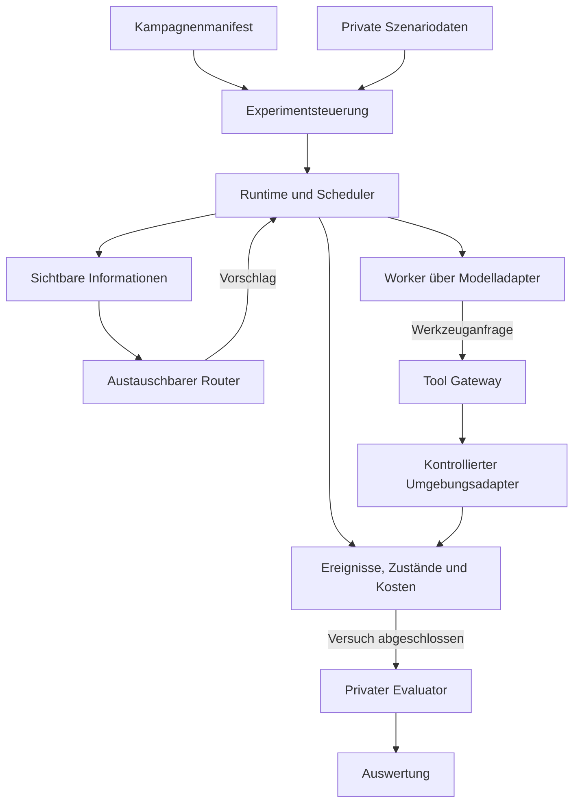

# Technische Spezifikation für selektive Agentenvermittlung

## 1. Geltung und Ziel

**Version:** 0.1.0. **Status:** Implementierungsgrundlage für den Forschungsprototyp. **Stand:** 13. September 2026.

Diese Spezifikation konkretisiert das Exposé *Selektive Agentenvermittlung bei unvollständiger Fähigkeitssicht und wechselnder Verfügbarkeit*. Sie legt Architektur, Zustandsübergänge, Informationszugänge, Auswahlverfahren, Kostenabrechnung und Abnahmekriterien fest. „MUSS“ bezeichnet eine verpflichtende Anforderung; „SOLL“ eine begründet abweichbare Empfehlung. Die hier benannten Schnittstellen und Befehle sind zu implementieren; sie existieren noch nicht.

Das System führt gepaarte Versuche mit identischen Aufgaben, Fähigkeiten, Ausgangsinformationen und Störungsspuren durch. Es vergleicht `central_active_v1`, `intent_local_v1` und `referral_local_v1`. Primäres Ergebnis ist die unabhängig geprüfte Zielerreichung innerhalb eines festgelegten Gesamtbudgets und einer simulierten Frist. Alle drei Verfahren verwenden dieselben Worker, Werkzeuge, Vergaberegeln und Prüfkomponenten.

Die erste Ausbaustufe umfasst acht Agenten, eine lokale Kommandozeile, eine kontrollierte Umgebung und drei Router. Eine Weboberfläche, produktive Konten, Internet-Agentensuche, Blockchain, ein verteiltes Konsenssystem und eine vollständig kompatible A2A-Implementierung gehören nicht zum MVP. Lokale Datenbank und zentraler Scheduler sind gemeinsame Versuchsinfrastruktur; die Arbeit darf daraus keine vollständig dezentrale Infrastruktur ableiten.

## 2. Architekturentscheidungen

| ID | Festlegung | Begründung und Grenze |
|---|---|---|
| ADR-01 | Python 3.12 als Zielruntime; exakte Interpreter- und Paketstände im Lockfile. | Ein gemeinsamer Prozess steuert die Episoden; Python passt zu den vorgesehenen Benchmarkadaptern. Die Kompatibilität des konkreten WorkBench-Commits wird in M0 geprüft. |
| ADR-02 | Eine SQLite-Datenbank pro Episode, ein schreibender Runtime-Prozess. | Vergabe, Kosten und geschützte Umgebungsänderungen können gemeinsam bestätigt werden. Parallelität entsteht zunächst zwischen Episoden. |
| ADR-03 | Ereignisjournal plus transaktional aktualisierte Zustandsprojektionen. | Wiederanlauf und Audit werden möglich, ohne einen separaten Streamingdienst einzuführen. |
| ADR-04 | JSON für öffentliche Verträge und Konfiguration; Validierung mit JSON Schema Draft 2020-12. | Versionierte und unabhängig prüfbare Schnittstellen. Zusätzliche Zustandsbedingungen werden in der Runtime geprüft. |
| ADR-05 | Worker und Router erhalten ausschließlich serialisierte Sichten; geschützte Wahrheit und Grader laufen getrennt. | Ein Python-Objekt ohne bestimmte Attribute allein ist keine ausreichende Isolationsgrenze für werkzeugfähige Agenten. |
| ADR-06 | Deterministische Fixture-Umgebung zuerst, WorkBench als erster Forschungsadapter. | Protokoll und Messung lassen sich ohne Modellkosten prüfen. Fixture-Ergebnisse werden niemals als WorkBench-Resultate ausgegeben. |
| ADR-07 | Anbieterneutraler Modelladapter; zunächst genau ein Live-Anbieter pro Hauptkampagne. | SDK- und Modellwechsel sollen den Routervergleich nicht verändern. Ein konkretes Modell wird nach dem Pilot im Manifest fixiert. |
| ADR-08 | Virtuelle Zeit für reproduzierbare Störungen; reale Zeit separat messen. | Der Hauptversuch untersucht modellierte Verfügbarkeit. Aussagen über reale verteilte Latenzen erfordern einen gesonderten Laufzeitversuch. |

Python stellt eine SQLite-Anbindung bereit; die Transaktionssteuerung muss ausdrücklich konfiguriert werden. Eine SQLite-Transaktion garantiert keine atomare Änderung eines beliebigen externen Dienstes. Deshalb gelten die Wirkungsregeln in Abschnitt 7 zunächst ausschließlich für den kontrollierten Adapter. Quellen: [Python sqlite3](https://docs.python.org/3.12/library/sqlite3.html), [SQLite Atomic Commit](https://www.sqlite.org/atomiccommit.html), [JSON Schema 2020-12](https://json-schema.org/draft/2020-12).

## 3. Komponenten und Vertrauensgrenzen



| Komponente | Verantwortlichkeit | Darf nicht |
|---|---|---|
| `experiment` | Manifest prüfen, Episoden planen, Seeds und Snapshots zuordnen, Ausgaben sammeln. | Während einer Episode die Routerentscheidung durch Sollwissen verbessern. |
| `runtime` | Authentisierte Akteure, Aufgaben, Vergaben, Budgets, Ereignisse und Fristen verwalten. | Fachliche Eignung anhand verborgener Kompetenzlabels auswählen. |
| `visibility` | Pro Akteur bekannte IDs, Profile, Kontakte und Beobachtungen projizieren. | Die vollständige Registry als versteckten Hilfsparameter ausgeben. |
| `routing` | Aus einer Sicht genau einen nächsten Vorschlag erzeugen. | Datenbank, private Szenarien, Grader oder rohe Umgebungsdateien lesen. |
| `workers` | Aufgabe bearbeiten, zugelassene Werkzeuge anfragen, Ergebnisse oder Fähigkeitsbedarf melden. | Eigene Werkzeugrechte erweitern oder Seiteneffekte direkt ausführen. |
| `model_gateway` | Modelle ansprechen, Aufrufreservierung, Usage und Transkripte erfassen. | Unsichere Wiederholungen ohne vorherigen Journalabgleich starten. |
| `environment` | Sandboxzustand lesen, Werkzeugoperationen vorbereiten und kontrolliert bestätigen. | Verborgene Sollzustände in gewöhnliche Werkzeugantworten übernehmen. |
| `operational_verifier` | Laufende Prüfung anhand zugelassener, sichtbarer Kriterien. | Auf verborgene Studiengrader zugreifen. |
| `grader` | Nach Abschluss Endzustand und unerlaubte Zusatzänderungen bewerten. | Während einer Episode Feedback an Agenten liefern. |
| `analysis` | Gepaarte Ergebnisse, Kosten und Unsicherheitsintervalle berechnen. | Fehlgeschlagene Läufe stillschweigend entfernen. |

Die Trennung MUSS durch Prozess- beziehungsweise Containergrenzen und beschränkte Dateimounts umgesetzt werden, sobald Agenten Code oder Dateizugriffe erhalten. Ein Fixture-Modus ohne solche Werkzeuge darf In-Process-Testdoubles verwenden. Nur der Modellgateway erhält Anbieterzugangsdaten. Die öffentlich exportierte Konfiguration enthält weder Secrets noch versteckte Sollantworten.

## 4. Identitäten, Datenmodell und Persistenz

Alle Objekte tragen `schema_version`. IDs sind opake Zeichenketten; sie dürfen keine Fähigkeit, Lösung oder Topologieposition codieren. Alle Schlüssel sind mindestens durch `episode_id` isoliert. Erzeugungszeit, kausaler Vorgänger und verantwortlicher Akteur werden protokolliert. Zeitangaben unterscheiden `sim_time` als nichtnegative Ganzzahl und `wall_time_utc`.

| Objekt | Pflichtfelder und Bedeutung |
|---|---|
| `Campaign` | `campaign_id`, `mode`, Methodenliste, Aufgabenmanifest-Hash, Regime, Seeds, Modell-/Prompt-/Preis-/Historien-Hashes, Codecommit, Adapterversion, Analysekriterien. |
| `Episode` | `episode_id`, `pair_id`, `method_id`, `task_instance_id`, `template_id`, `regime_id`, Seedbundle, Snapshot-/Graph-/Störungshash, Status, Start-/Endzeit. |
| `AgentProfile` | `agent_id`, Profilversion, deklarierte Fähigkeiten, zulässige Werkzeugschemata, Subscriptiontext. Fachliche Leistungslabels gehören nicht hierher. |
| `Observation` | Empfänger, Subjekt, Art, Wert/Artefaktreferenz, Sichtbarkeitsgrund, Beobachtungszeit, Profilversion und Quellereignis. |
| `Task` | `task_id`, `parent_task_id`, `root_task_id`, `requirement_key`, Eingabeversion/-hash, Ziel, sichtbare Kriterien, erlaubte Tools, Abhängigkeiten, Zustand, Budgetzuordnung, Frist, Vergabeepoche. |
| `Attempt` | `attempt_id`, Aufgabe/Eingabeversion, Agent, Epoche, Angebotsreferenz, Zustand, Beginn, Ablaufzeit, Checkpointreferenz, Endgrund. |
| `Artifact` | `artifact_id`, Inhaltshash, Medientyp, Ersteller, Task-/Attempt-/Eingabeversion, unveränderlicher Inhalt. |
| `Verification` | Einreichung, Prüfer, Prüfschemaversion, Urteil `PASS/FAIL/INCONCLUSIVE`, Belegreferenzen, Kostenreferenz. |
| `Event` | Ereignis-ID, Episodensequenz, Typ, Akteur, Empfänger, Zeit, Task/Attempt/Epoche, Kausalität, Payloadhash und Payloadreferenz. |
| `Reservation` | Reservierungs-ID, Root-Budget, Aktion, Phase, Höchstbetrag, Status `OPEN/SETTLED/UNKNOWN/RELEASED`, tatsächlich abgerechneter Betrag. |
| `EffectReceipt` | Stabile Wirkungs-ID, kanonische Argumente, Inputversion, Epoche der Ausführung, Ergebnis und bestätigte Umgebungsrevision. |
| `ReputationEvidence` | Beobachter, bewerteter Agent, Aufgabenklasse, Dimension `EXECUTION/REFERRAL`, sichtbares Prüfergebnis, Alter und Provenienz. |
| `Grade` | Episoden-ID, privater Graderhash, Endzustandshash, Zielerfolg, Zusatzänderungen, Auswertungsstatus. Erst nach Episodenende verfügbar. |

### 4.1 Verbindliche Datenbankbedingungen

Die Tabellen `tasks`, `attempts`, `events`, `observations`, `reservations`, `effects`, `environment_state` und `outbox` liegen für eine Episode in derselben Datenbank. Fremdschlüssel werden aktiviert. Für Änderungen verwendet die Runtime explizite Transaktionen; externe Modellaufrufe laufen außerhalb einer offenen Schreibtransaktion. Die SQLite-Version und die gewählten Durability-Einstellungen werden im Manifest gespeichert.

Es gelten mindestens folgende Eindeutigkeitsbedingungen:

- `(episode_id, command_id)` für empfangene Befehle und deren gespeicherte Antwort.
- `(episode_id, event_seq)` für die totale Journalreihenfolge.
- `(episode_id, task_id, epoch)` für Vergaben; pro Aufgabe höchstens ein aktiver oder pausierter, noch berechtigter Versuch.
- `(episode_id, root_task_id, effect_key)` für verbindliche Wirkungen.
- `(episode_id, parent_task_id, input_version, requirement_key)` für deduplizierte Folgeaufgaben.
- `(episode_id, model_call_id)` für externe Modellaufrufe und deren Kostenreservierung.

Journalereignis, Zustandsänderung und Outbox-Eintrag MÜSSEN gemeinsam bestätigt werden. Der Dispatcher darf Outbox-Einträge mehrfach zustellen; Empfänger deduplizieren. Ein Absturz nach Commit und vor Zustellung darf weder das Ereignis verlieren noch eine zweite Vergabe erzeugen.

## 5. Nachrichten und Schnittstellen

### 5.1 Nachrichtenhülle

```json
{
  "schema_version": "1.0",
  "episode_id": "ep-001",
  "command_id": "cmd-017",
  "kind": "RESULT_SUBMIT",
  "actor_id": "agent-b",
  "recipient_id": "runtime",
  "task_id": "task-03",
  "attempt_id": "attempt-02",
  "epoch": 2,
  "input_version": 1,
  "causation_id": "event-042",
  "payload": {"artifact_id": "artifact-008"}
}
```

`actor_id` MUSS mit der vom Gateway festgestellten Identität übereinstimmen. Die Runtime vergibt Zeit und Journalnummer; Agenten dürfen diese nicht bestimmen. Pflichtfelder hängen vom Nachrichtentyp ab. Unbekannte Felder werden bei öffentlichen Verträgen abgewiesen. Gleiche `command_id` mit gleicher normalisierter Payload liefert die gespeicherte Antwort; andere Payload bei derselben ID führt zu `IDEMPOTENCY_CONFLICT`.

| Befehl | Ergebnis und Vorbedingungen |
|---|---|
| `TASK_REQUEST` | Erstellt eine Root-Aufgabe oder eine erlaubte Teilaufgabe. Herkunft und Gesamtbudget werden geprüft. |
| `DISCOVER_DESCRIBE` | Liefert das Profil einer bereits bekannten und zugänglichen ID. Ein unbekanntes Ziel wird nicht als existierend bestätigt. |
| `DISCOVER_CONTACTS` | Liefert eine begrenzte, paginierte Liste der Kontakte eines bekannten erreichbaren Teilnehmers. Neue IDs werden als Beobachtung gespeichert. |
| `PROBE` | Liefert eine zeitpunktbezogene Verfügbarkeitsbeobachtung. Sie ist keine Zusicherung künftiger Verfügbarkeit. |
| `OFFER_REQUEST` | Fordert von einem bekannten Teilnehmer ein Angebot für Task und Eingabeversion an; verrät keine verborgenen Eignungslabels. |
| `OFFER` | Agent bietet einen konkreten Task/Input mit befristeter Gültigkeit an; enthält ausführbaren Kapazitätsbedarf. |
| `REFERRAL_FORWARD` | Überträgt sichtbaren Bedarf, Such-ID, Route und verbleibende Grenzen an einen bekannten Kontakt; erweitert ausschließlich dessen dokumentierte Beobachtungen. |
| `AWARD_PROPOSE` | Router schlägt die Vergabe eines gültigen Angebots vor. Nur die Runtime kann daraus `AWARD_COMMITTED` erzeugen. |
| `TOOL_REQUEST` | Prüft Aufgabe, Versuch, Epoche, Rechte und Budget vor Werkzeugausführung. |
| `NEED_CAPABILITY` | Meldet einen konkreten fehlenden Beitrag mit `requirement_key`, erlaubten Inputs und sichtbarem Nachweis. |
| `RESULT_SUBMIT` | Speichert eine unveränderliche Einreichung für den aktuellen Versuch. |
| `VERIFY_RESULT` | Betrieblicher Prüfer erzeugt `PASS/FAIL/INCONCLUSIVE`; die Runtime setzt den Folgezustand. |
| `CANCEL` | Entzieht weitere Ausführungsberechtigung und bricht offene abhängige Arbeit ab. Bereits bestätigte Effekte werden nicht rückgängig gemacht. |
| `STATUS` | Liefert nur den für den Akteur sichtbaren Status; die Abfrage hat die im Kostenmodell definierten Kosten. |
| `WAIT` | Rückt bis zu einem konfigurierten positiven Zeitschritt vor, ohne zukünftige Störungen offenzulegen. Root-Frist und laufende Leases gelten weiter. |

### 5.2 Implementierungsverträge

```text
Router.decide(view: RoutingView) -> ProposedAction
Worker.step(view: WorkerView) -> ToolRequest | NeedCapability | ResultSubmit | Failure
Visibility.project(actor_id, event_cursor) -> ActorView
ModelGateway.complete(request, reservation_id) -> ModelResult
Environment.prepare(snapshot, authorized_tool_call) -> PreparedTransition
Environment.commit(prepared, expected_revision, effect_key, epoch) -> EffectReceipt
OperationalVerifier.check(submission, public_context) -> Verification
PrivateGrader.grade(final_snapshot, private_case) -> Grade
```

`RoutingView` enthält ausschließlich beobachtete Kandidatenprofile, lokale Historie, sichtbaren Aufgabenbedarf, offene Angebote, verbleibendes Budget und die zuletzt beobachteten Zustände. `WorkerView` enthält Aufgabe, zulässige Tools, tatsächlich gelieferte Inputs und den lokalen Gesprächsverlauf. Weder View enthält den globalen Kandidatenpool, versteckte Kompetenzen, zukünftige Störungen oder Graderdaten.

## 6. Aufgaben- und Ausführungszustände

| Ausgangszustand der Aufgabe | Ereignis | Folgezustand | Wirkung |
|---|---|---|---|
| `OPEN` | Gültige Vergabe | `ASSIGNED` | Epoche erhöhen, Versuch und erste Aktionsreservierung anlegen. |
| `ASSIGNED` | Ausführung startet | `RUNNING` | Start protokollieren. Das Startsignal ist kein zweiter Vergabeschritt. |
| `RUNNING` | Erlaubter zusätzlicher Bedarf | `WAITING` | Checkpoint sichern, Teilaufgabe anlegen; Elternrechte für Schreibaktionen pausieren. |
| `WAITING` | Alle notwendigen Kinder akzeptiert | `RUNNING` | Neue Inputs kontrolliert liefern, Elternversuch reaktivieren. |
| `RUNNING` | Gültige Einreichung | `SUBMITTED` | Artefakt speichern; keine weiteren Worker-Schreibaktionen zulassen. |
| `SUBMITTED` | Prüfung gestartet | `VERIFYING` | Prüferkosten reservieren. |
| `VERIFYING` | `PASS` | `ACCEPTED` | Berechtigung beenden; operativ akzeptiert, wissenschaftlich noch unbewertet. |
| `VERIFYING` | `FAIL/INCONCLUSIVE`, Budget vorhanden | `OPEN` | Versuch beenden, nächste Epoche erst bei Neuvergabe; Überarbeitung zählt als Versuch. |
| `ASSIGNED` / `RUNNING` | Versuch abgelaufen/Agent ausgefallen | `OPEN` oder `FAILED` | Versuch invalidieren; nur bei verbliebenen Ressourcen neu anbieten. |
| Nichtterminal | Budget oder Frist erschöpft | `FAILED` | Offene Berechtigungen entziehen und Kinder abschließen/abbrechen. |
| Nichtterminal | Gültiger Abbruch | `CANCELED` | Keine weitere Wirkung zulassen. |

`ACCEPTED`, `FAILED` und `CANCELED` sind terminal. Eine terminale Aufgabe wird nicht wieder geöffnet. Ein ausdrücklich erlaubter neuer Auftrag erhält eine neue Identität und neue Budgetautorisierung. Änderungen der Eingabeversion invalidieren laufende Versuche und abhängige Einreichungen. Das Originalartefakt bleibt zur Nachvollziehbarkeit erhalten.

Versuche haben eigene Zustände `ASSIGNED`, `RUNNING`, `SUSPENDED`, `SUBMITTED`, `SUCCEEDED`, `FAILED`, `EXPIRED`, `CANCELED`. Bei `WAITING` wird das Lease des Elternversuchs pausiert, die Root-Frist jedoch nicht. Standardgrenzen für den Fixture-Modus sind drei Versuche pro Aufgabe, eine Teilaufgabentiefe von zwei und höchstens vier Aufgaben insgesamt pro Root. Ein Kind darf keine Abhängigkeit auf seinen Vorfahren erzeugen. Scheitert ein notwendiges Kind endgültig, scheitert die wartende Elternaufgabe mit `DEPENDENCY_FAILED`.

Ein gültiger `RESULT_SUBMIT` beendet das Ausführungslease. Ein späterer Ausfall des Workers verwirft das gespeicherte Resultat nicht; `SUBMITTED` und `VERIFYING` unterliegen weiterhin der Root-Frist und dem gemeinsamen Budget. Fällt ein pausierter Elternagent aus, bleibt sein Checkpoint erhalten. Bei Wiederaufnahme wird seine Erreichbarkeit geprüft; nötigenfalls wird der Elternversuch beendet und unter den bestehenden Versuchslimits neu vergeben. Akzeptierte Kinder werden dabei nicht erneut ausgeführt.

## 7. Verbindliche Wirkungen und Wiederanlauf

### 7.1 Atomare Vergabe

In einer Transaktion prüft die Runtime Eingabeversion, offenen Zustand, Angebotsgültigkeit, beobachtbare Erreichbarkeit und Budget. Sie erhöht die Epoche, legt den Versuch an und schreibt `AWARD_COMMITTED`. Zwei gleichzeitige Vergabevorschläge können dadurch nicht zwei aktuelle exklusive Berechtigungen erzeugen. Ein Ausfall unmittelbar danach kann trotzdem den Fortschritt verhindern und wird durch Ablauf oder erneute Beobachtung behandelt.

### 7.2 Werkzeugoperationen

Werkzeugaufrufe laufen ausschließlich über das Gateway. Ein read-only Aufruf liefert eine autorisierte Projektion des Zustands. Eine schreibende Operation wird aus einem Snapshot deterministisch vorbereitet; sie liefert einen möglichen Folgezustand und eine Antwort, erzeugt aber noch keine externe Wirkung. Beim Commit prüft die Runtime erneut Epoche, Taskzustand, Rechte und Umgebungsrevision.

Der neue Sandboxzustand, die Wirkungsquittung, Kostenabrechnung und das Journalereignis werden gemeinsam in derselben SQLite-Transaktion gespeichert. Ein Revisionskonflikt führt zu `REVISION_CONFLICT`; ein erneuter Versuch benötigt einen neuen autorisierten Read/Prepare-Schritt. Kein Worker darf parallel direkt dieselbe Datenbank verändern.

Der erste WorkBench-Adapter MUSS dafür Snapshot/Restore und reine Vorbereitung einer Operation unterstützen. Kann ein konkretes Werkzeug diese Bedingung nicht erfüllen, wird es zunächst nur lesend freigegeben oder der Adapter gilt für den Forschungslauf als nicht abgenommen. Ein separater externer Datenbankcommit wird nicht als atomar mit dem Runtime-Journal ausgegeben.

### 7.3 Wirkungsidentität

`effect_key` identifiziert eine erlaubte fachliche Operation über Wiederholungen und Agentenwechsel hinweg. Sie enthält Root-Aufgabe, Zielobjekt, Operationsart, Eingabeversion und einen stabilen logischen Operationsschlüssel. Sie enthält weder eine frische Nachrichten-ID noch die Attempt-ID als alleinigen Unterscheider. Eine neue Attempt-ID darf denselben genehmigten Schreibvorgang nicht noch einmal wirksam machen.

Der Adapter definiert je Werkzeug, wann eine Wiederholung dieselbe Operation ist. Absichtlich mehrfache gleiche Aktionen benötigen unterschiedliche, im Aufgabenvertrag zulässige Operationsschlüssel. Im MVP sind nur Werkzeuge mit definierter Kanonisierung erlaubt. Eine doppelte Anfrage liefert die bestehende Quittung, sofern der aktuelle Akteur sie lesen darf. Ein zurückgekehrter alter Agent darf auch mit einer neuen Nachrichten-ID keine weitere Wirkung ausführen.

### 7.4 Neustart

Beim Neustart liest die Runtime Journal, Outbox, Reservierungen und Wirkungsquittungen. Bestätigte Effekte werden nicht wiederholt. Nicht gestartete Aktionen dürfen wieder eingereiht werden. Bei bereits gestarteten externen Modellaufrufen ohne eindeutige Antwort erfolgt kein blindes Resenden: Der Aufruf bleibt `UNKNOWN`, die Reservierung bleibt bestehen. Soweit der Anbieter einen sicheren Statusabruf unterstützt, darf der Adapter abgleichen; andernfalls endet die Episode nachvollziehbar mit ungeklärtem Infrastrukturstatus.

Reproduzierbarkeit bedeutet deterministische Fixture- und Journalwiedergabe. Neue Live-Modellaufrufe sind trotz gleicher Seeds nicht als bitgenau reproduzierbar garantiert. Ein Transkriptreplay bedient nur exakt passende Request-Hashes; bei einer abweichenden Anfrage stoppt es mit `REPLAY_MISS`.

## 8. Informationszugang und wissenschaftliche Vergleichbarkeit

**VIS-01:** Der private Szenarioerzeuger hält vollständige Registry, wahre Werkzeugzuordnung, Kontaktgraph, Störungsspur und Sollzustand. Nur Runtime, Adapter beziehungsweise Grader erhalten die jeweils nötigen privaten Teile. Router und Worker sehen sie nicht.

**VIS-02:** Im partiellen Regime kennt der Initiator zwei identische Startprofile. Jeder Agent kennt seine eigene Identität und seine lokalen Kontakt-IDs. Diese lokalen IDs werden dem Initiator erst durch eine erlaubte Kontaktantwort bekannt. Welche Nachbarprofile zusätzlich lokal vorliegen, wird für alle Methoden aus demselben Snapshot initialisiert.

**VIS-03:** Eine bekannte ID bedeutet nicht, dass ihr Profil, ihre aktuelle Verfügbarkeit oder ihr lokales Wissen bekannt ist. `describe`, `contacts` und `probe` erzeugen getrennte Beobachtungen und Kosten. Unbekannte ID und unberechtigter Zugriff liefern dieselbe äußere Fehlerklasse `NOT_OBSERVABLE`. Negatives Raten darf kein Existenzorakel bilden.

**VIS-04:** Die Reihenfolge von Kontaktseiten ist durch einen szenariogebundenen Seed bestimmt und unabhängig von versteckter Eignung. Fortsetzungscursor sind opak. Auch ein globaler Suchindex darf ausschließlich bereits gewonnene Profile enthalten.

**VIS-05:** Die zentrale Strategie darf bezahlte Antworten zusammenführen. Die lokale Strategie darf fremde lokale Sichten nur durch explizit zugestellte Nachrichten nutzen. Die Runtime hält eine vollständige Debugsicht, reicht diese aber nicht an Router weiter. Jeder neu sichtbare Datensatz benötigt ein Provenienzereignis.

**VIS-06:** Werkzeugrechte ergeben sich aus der serverseitigen Agentenkonfiguration, nicht aus Profiltext, einer Subscriptionänderung oder einer Empfehlung. Kenntnis eines Tools erteilt kein Ausführungsrecht.

**VIS-07:** Vorgeschichten werden pro Episode aus demselben Entwicklungs-Snapshot kopiert. Es gibt keinen Gedächtnistransfer zwischen Testepisoden oder Vergleichsarmen. Im Hauptlauf werden neue Erfahrungen protokolliert, aber nicht in aktive Scores eingerechnet. Online-Updates benötigen eine gesonderte Kampagne.

## 9. Auswahlverfahren

### 9.1 Gemeinsame Bausteine

Alle Verfahren verwenden dieselbe versionierte Matchingfunktion, dieselben verfügbaren Beobachtungen und dieselben Workerprompts. Für den ersten Fixture-Modus ist Matching ein deterministischer Vergleich deklarierter Capability-IDs. Im WorkBench-Pilot kommt ein festgelegtes Textmatching auf sichtbaren Beschreibungen hinzu. Ein Embedding-Modell darf verwendet werden, wenn Identität, Indexinhalt, Initialisierung und Kosten protokolliert sind. Versteckte Werkzeuglabels sind kein Matchinginput.

Es gibt zwei beobachtungsbasierte Werte je Aufgabenklasse: `expertise` für erfolgreiche fachliche Bearbeitung und `sociability` für hilfreiche Vermittlung. Im Startmodell gilt für beide `(successes + 1) / (successes + failures + 2)`. Fehlende Beobachtungen ergeben 0,5. Diese geglätteten Raten werden nicht als kalibrierte Wahrscheinlichkeiten bezeichnet. Vorübergehende Unverfügbarkeit verändert sie nicht.

Ein gemeinsamer Kandidatenscore lautet als Startkonfiguration:

```text
candidate_score = 0.60 * visible_match + 0.30 * expertise + 0.10 * freshness
freshness = max(0, 1 - observation_age / freshness_horizon)
relay_score = 0.40 * visible_match + 0.50 * sociability + 0.10 * freshness
```

Alle Größen liegen in `[0,1]`; unbekannte Aktualität wird mit 0 bewertet. Gewichte, Mindestmatch und Zeithorizont stehen in der Konfiguration. Sie dürfen nur vor dem Test anhand von Entwicklungsdaten angepasst werden. Bekannte vorübergehende Unverfügbarkeit sperrt einen Kandidaten bis zum Ablauf der Beobachtungs-TTL, danach ist erneut zu prüfen. Gleichstände werden deterministisch durch einen episodenbezogenen Tie-Break-Seed aufgelöst.

### 9.2 `central_active_v1`

Der Initiator führt einen zentralen Cache aller rechtmäßig empfangenen Profile und Erfahrungen. Er prüft den bestbewerteten bekannten Kandidaten und fordert bei Eignung ein Angebot an. Gibt es keinen ausreichenden Kandidaten, erweitert er den Cache über den bestbewerteten bekannten Vermittlungskontakt und dessen nächste Kontaktseite. Er kann dadurch Erfahrungen und lokale Empfehlungen genauso nutzen wie die vorgeschlagene Methode. Nach jeder Antwort wird global innerhalb des bekannten Bestands neu priorisiert.

Die Suche endet bei gültiger Vergabe, vollständiger Erschöpfung der erreichbaren Frontier oder Ressourcenende. Ein leerer oder fachlich ungeeigneter Kontakt verhindert nicht die Erkundung anderer bekannter Kontakte. Dieses Verfahren ist die starke zentrale Hauptbaseline; es darf nicht auf eine einmalige, veraltete Registryabfrage beschränkt werden.

### 9.3 `intent_local_v1`

Die jeweils aktive Vermittlungsinstanz hält Subscriptions der ihr bekannten Teilnehmer. Sie gleicht den sichtbaren Bedarf mit diesen Subscriptions ab, bewertet passende Kandidaten mit dem gemeinsamen Score und fordert Angebote an. Fehlen passende Kandidaten, ruft sie Kontakte der bestbewerteten bekannten Vermittler ab und lädt deren Profile. Die gleiche Such-API und das gleiche maximale Kontaktbudget stehen ihr offen.

Nach einer Werkzeugantwort darf ein Teilnehmer seine Bedarfsspezifikation durch ein validiertes `NEED_CAPABILITY` präzisieren. Eine Subscriptionänderung erhält eine neue Profilversion, verbreitet sich nur durch Nachrichten und erweitert keine Werkzeugrechte. Ein lokaler Treffer kann den aktiven Vermittlungskontext an den Empfänger übertragen. Die öffentliche Bezeichnung lautet ausdrücklich „intentbasierte lokale Adaption, inspiriert von RAPS“. Eine vollständige Reproduktion von RAPS einschließlich dessen Watchdogs und globaler Subscriptions ist ein eigener Adapter mit eigener Methoden-ID.

### 9.4 `referral_local_v1`

Ein Vermittler versucht zuerst eine geeignete bekannte direkte Vergabe. Ist diese nicht möglich, wählt er nach `relay_score` höchstens zwei lokale Kontakte und sendet den sichtbaren Bedarf samt bisheriger Route. Empfänger führen dieselbe Regel mit ihrer eigenen Sicht aus. Die Route darf keine ID wiederholen. Die Tiefe zählt tatsächlich durchlaufene Vermittlungskanten; am Limit sind direkte Ausführung und Antwort erlaubt, weiteres Weiterreichen nicht.

Eine Route besitzt eine pro Suchauftrag gemeinsame Besuchsmenge und einen Kontaktzähler. Branching erzeugt kein neues Suchbudget. Weitere Wellen dürfen noch nicht besuchte Kontakte verwenden, solange Tiefe, Kontaktlimit und Root-Budget es zulassen. Scheitern alle Routen, verwendet das Verfahren die gleiche verbliebene Frontier-Suche wie die zentrale Baseline; auch diese Arbeit wird vollständig berechnet. Kann kein Teilnehmer gefunden werden, folgt `DISCOVERY_EXHAUSTED`.

Die konfigurierte maximale Distanz vom Startbestand eines Suchauftrags gilt für alle drei Hauptverfahren und auch für den Fallback. Erkundung darf das Hoplimit nicht durch Umbenennen des Suchauftrags umgehen. Ein neuer echter Fähigkeitsbedarf darf einen neuen Suchauftrag erzeugen; der Root-Kontakt- und Kostenverbrauch bleibt erhalten. Lokale, noch nicht abgefragte Kontakte erlauben keinen kostenlosen Zugriff auf deren Profile.

Ein Kontakt zählt als gestartete Discovery-Nachricht an einen Teilnehmer: `DISCOVER_DESCRIBE`, `DISCOVER_CONTACTS`, `PROBE`, `OFFER_REQUEST` oder `REFERRAL_FORWARD`. Transportduplikate derselben Command-ID zählen einmal; erneute fachliche Anfragen mit neuer ID zählen erneut. Zähler werden vor dem Versand atomar reserviert. Es gelten gleichzeitig `max_contacts_per_search` und `max_contacts_per_root` (Fixture: 12 beziehungsweise 32). Ein Ausführungsretry für denselben kanonischen Bedarf nutzt denselben Suchauftrag. Die Runtime dedupliziert neuen Bedarf über Root-ID, benötigte Fähigkeit und relevante Eingabeversion; abweichender Freitext allein erzeugt keinen neuen Suchauftrag.

Fachliche Erfolgsbelege beziehen sich auf den Ausführenden. Vermittlungserfolg wird einem Kontakt nur zugerechnet, wenn seine Empfehlung kausal zu einer verfügbaren Übernahme und operativ akzeptierten Leistung führte. Mehrere Empfehlungen derselben Kette dürfen dieselbe Beobachtung nicht mehrfach für dieselbe Kante zählen. Im Hauptlauf beeinflussen diese neuen Belege die Auswahl noch nicht.

### 9.5 Diagnostische Verfahren

`random_referral_v1` verändert ausschließlich die Kontaktpriorität bei identischem Fanout, Tiefen- und Kontaktlimit. `referral_no_history_v1` setzt die Erfahrungswerte auf 0,5. `bounded_broadcast_v1` fragt gleichzeitig mehrere bereits entdeckte Kandidaten unter denselben Budgets an. `single_union_v1` erhält die Vereinigungsmenge der Werkzeuge und wird als privilegierte Referenz markiert, wenn dadurch Rollenrechte aufgehoben werden.

Für H3 ergänzt `referral_shuffled_history_v1` eine vorab gesampelte Permutation der historischen Vermittlungswerte zwischen Kontakten innerhalb derselben Aufgabenklasse. Verteilung und Anzahl der Werte bleiben erhalten; Profilinformationen, fachliche Expertise, Sichtbarkeit und alle Budgets bleiben unverändert. Permutationsseed und Zuordnung werden privat protokolliert. Diese Ablation ist von zufälliger Kontaktwahl und vollständig entfernter Historie zu unterscheiden.

Ein `agentnet_reference` oder `raps_reference` benötigt einen geprüften Codecommit, eigene Abweichungsdokumentation und passende native Informationsbedingungen. Fehlt eine Replikation, bleibt sie als `not_run` sichtbar. Keine lokale Nachbildung wird als unverändertes Original publiziert.

## 10. Zeit, Verfügbarkeit und Störungen

Die Runtime führt eine ereignisbasierte Simulationsuhr. Für jede Operationsklasse enthält das Zeitmodell eine feste Dauer oder eine vorab gesampelte, reproduzierbare Dauer. Zufallswerte werden aus Aufgabe, Seed, Agent, Operationsklasse und lokalem Aufrufindex abgeleitet, nicht aus der globalen Reihenfolge verschiedener Methoden. Unterschiedliche Methoden dürfen dadurch verschiedene Ereignisfolgen erleben; die äußere Verfügbarkeitsspur bleibt dieselbe.

Bei gleicher `sim_time` gilt: zuerst externe Verfügbarkeitsereignisse, dann Lease-/Taskfristen, dann Aktionsabschlüsse, danach neue Entscheidungen. Ein Commit genau zur Ablaufzeit wird somit abgewiesen. Innerhalb einer Klasse ordnet ein stabiler Schlüssel die Ereignisse. Netzwerkzustellung ist mindestens einmal modelliert; Duplikate und Verzögerungen werden vorab gesampelt.

`agent_down` verhindert neue Zustellungen und invalidiert zum Ereigniszeitpunkt noch laufende Aktionen dieses Agenten. Bereits bestätigte Effekte bleiben bestehen. `agent_up` ermöglicht neue Zustellungen, reaktiviert aber keine abgelaufene Epoche. Neue Verfügbarkeit wird nur durch zulässige Nachrichten oder Probes bekannt. Die private Störungsspur ist nicht Teil der Agentensicht.

Der Regimewert `availability=stable` deaktiviert Verfügbarkeitsstörungen vollständig. Nur `availability=churn` lädt die konfigurierte `availability_trace`. Der Szenariogenerator prüft diese Zuordnung vor dem Start; die bloße Angabe einer Spur aktiviert keine Störung im stabilen Regime.

Im kontrollierten Hauptlauf können Modellaufrufe real nacheinander ausgeführt werden, während ihre Ergebnisse gemäß simulierter Abschlusszeit eingeordnet werden. Die gewählte Schedulerstrategie und maximale logische Parallelität gelten für alle Methoden. Reale API-Wartezeiten verändern die Simulationsspur nicht. Ein gesonderter realzeitlicher Versuch misst tatsächliche Latenz und Anbieterlimits; seine Daten werden getrennt ausgewertet.

## 11. Budgets und Kostenabrechnung

Es gibt ein gemeinsames Root-Budget als Ganzzahl in Mikro-Krediten sowie Grenzen für Modellaufrufe, Kontakte, Versuche und virtuelle Zeit. Mikro-Kredite sind eine experimentelle Rechnungseinheit, kein Anbieterpreis. Ein versioniertes Tarifmodell bewertet Input-/Output-/Reasoningmengen, Embeddings und Werkzeuge; reale Geldkosten werden zusätzlich in der jeweiligen Währung berichtet.

Vor jeder kostenpflichtigen Aktion gilt atomar:

```text
spent + reserved + upper_bound(action) <= root_limit
```

Nur dann wird eine Reservierung angelegt und die Aktion gestartet. Nach bekannter Usage wird die Reservierung einmalig in Ausgaben umgewandelt und der Rest freigegeben. Teilaufgaben reservieren aus demselben Root-Konto; sie erhalten kein frisches Gesamtbudget. Eine Taskzuweisung selbst benötigt keine geschätzte Vollauftragsreservierung, jede folgende Aktion jedoch eine belastbare Obergrenze.

Für Live-Modelle erfordert die Obergrenze berechnete Inputmenge, konfiguriertes Output-/Reasoningmaximum und bekannte weitere abrechenbare Einheiten. Ein Anbieteradapter ohne belastbare Kostengrenze ist nicht für einen strikt budgetbegrenzten Hauptlauf zugelassen. Bei unsicherer Usage bleibt die volle Reservierung bestehen; geschätzte und bestätigte Kosten werden getrennt exportiert. Überschreitet ein Adapter entgegen seinem Vertrag die Obergrenze, wird `COST_CONTRACT_VIOLATION` protokolliert und die Kampagne angehalten.

Der Adapter normalisiert Usage in disjunkte Rechnungseinheiten. Wenn Reasoning bereits in der gemeldeten Outputmenge enthalten ist, wird es nicht zusätzlich als Output plus Reasoning doppelt berechnet. Originalwerte und Normalisierungsregel bleiben gespeichert. Das übergeordnete Kampagnenkonto reserviert vor Episodenstart deren Obergrenze und rechnet den Rest nach Abschluss zurück; Neustart setzt dieses Konto nicht zurück.

Phasen sind `SETUP`, `DISCOVERY`, `ROUTING`, `EXECUTION`, `OPERATIONAL_VERIFY`, `RETRY`, `AGGREGATE`. Jede Kostenbuchung hat genau eine Phase. Interner Aufwand des Routers zählt mit. Vorbereitungskosten werden separat ausgewiesen und nur mit explizitem Amortisationsnenner verteilt. Der private Evaluator zählt als `RESEARCH_EVALUATION` außerhalb des Root-Budgets; er unterstützt den Agenten nicht während der Ausführung.

Ein Timeout oder Abbruch eines gestarteten Modellaufrufs bedeutet nicht automatisch null Kosten. Er bleibt als gestartet im Journal. Studienauswertung und Infrastrukturabrechnung müssen dieselben Call-IDs referenzieren können.

## 12. Benchmarkadapter und Prüfer

Der Fixture-Adapter enthält mindestens: direkte eindeutige Aufgabe, spät erkennbarer Umwandlungsbedarf, notwendiges paralleles Kind, unerreichbarer Spezialist, Ausfall vor Vergabe und Ausfall nach Commit. Ergebnis und erlaubte Zusatzänderungen sind deterministisch prüfbar. Diese Fälle dienen der Implementierungsabnahme und werden nicht als wissenschaftliche Stichprobe gezählt.

WorkBench wird über einen dokumentierten Commit beziehungsweise Datensatzstand eingebunden. Provenienz, Nutzungsbedingungen, Aufgaben- und Template-IDs, verwendete Teilmenge und Änderungen werden gespeichert. Der Adapter muss Initialzustand wiederherstellen, erlaubte Werkzeugoperationen ausführen und einen unabhängigen Zielzustandsvergleich ermöglichen. Hintergrund: [WorkBench, Autorenfassung](https://arxiv.org/html/2405.00823v2).

Jede künstlich eingeführte späte Anforderung erhält `variant_id`, Auslöseregel und private Referenztests. Die Auslöseregel hängt vom Umgebungszustand ab, nicht von `method_id`. Unveränderte und modifizierte Aufgaben werden separat gekennzeichnet. Entwicklungs- und Testsplit erfolgen auf Template-/Aufgabenfamilienebene, soweit mehrere Instanzen dieselbe Vorlage teilen.

Der operative Prüfer verwendet ausschließlich sichtbare Kriterien und verfügbare Testartefakte. Er kann irren. Sein `PASS` ergibt die interne Aufgabenannahme; der private Grader entscheidet nach Ende über den wissenschaftlichen Erfolg. Leere Ergebnisse, erwartete falsch-positive Prüferurteile und unerlaubte zusätzliche Änderungen müssen gezielt geprüft werden. Ein Grader darf weder über Dateien noch über Diagnoseendpunkte erreichbar sein.

## 13. Experimentsteuerung und Export

Ein aufgelöstes Manifest MUSS alle Versionsstände und Hashes enthalten. `latest`, unaufgelöste Platzhalter und nachträgliche automatische Modellwechsel sind im Hauptlauf unzulässig. Ein Manifest wird vor Laufbeginn unveränderlich gespeichert. Ein neuer Prompt, Score, Adapter, Tarif oder Sichtbarkeitsmechanismus erzeugt eine neue Kampagnenversion.

`pair_id` wird aus Taskinstanz, Variante, Regime, Seedbundle und Infrastrukturkonfiguration gebildet, ohne Methoden-ID. `episode_id` ergänzt die Methode. Ein Paar teilt Snapshot, Profile, historische Belege, Kontaktgraph, Störungsspur und Budget. Methodenabhängige Requests erhalten eigene IDs; Modellantworten werden nicht unzulässig zwischen unterschiedlichen Prompts geteilt.

### 13.1 Vorgesehene Kommandozeile

```text
agentflow validate campaign.json
agentflow plan campaign.json --output plan.json
agentflow run campaign.json --mode fixture
agentflow run campaign.json --mode live
agentflow resume campaign-id
agentflow replay episode-id --source recorded
agentflow grade campaign-id
agentflow analyze campaign-id --analysis-plan analysis.json
agentflow export campaign-id --output artifact-directory
```

Diese Befehle sind zukünftige Interfaces. `plan` führt keine Modellaufrufe aus. Ein Live-Aufruf benötigt ein vollständig aufgelöstes Modell- und Tarifmanifest sowie ein explizites Kampagnenlimit; der Batch läuft innerhalb dieses Limits. Die Forschungsmanifestierung ist keine Genehmigung für produktive Seiteneffekte. Fixture-Modus benötigt keine Anbieterzugänge.

### 13.2 Ausgabevertrag

Pro Kampagne entstehen `manifest.resolved.json`, `run_plan.json`, `analysis_plan.json`, `episodes.jsonl`, `events.jsonl`, `usage.jsonl`, `grades.jsonl`, `metrics.json` und `report.md`. Private Benchmarkreferenzen werden nicht in das öffentliche Paket kopiert. Verteilbare Artefakte und Transkripte erhalten Inhaltshashes; eingeschränkte Datensätze werden durch reproduzierbare Bezugs- und Prüfhinweise ersetzt.

`episodes.jsonl` enthält für jede zugelassene Episode Methode, Paar-/Template-ID, Regime, terminalen Grund, `operational_accept`, `goal_correct`, `no_forbidden_effect`, `within_budget`, `within_deadline`, Kostenstatus und Kostenmengen. Zusätzlich werden Matching-, Adapter- und Prüferstände referenziert.

Der primäre Erfolgswert ist:

```text
success = goal_correct
          AND no_forbidden_effect
          AND within_budget
          AND within_deadline
          AND evaluation_complete
```

Eine intern abgelehnte, aber tatsächlich richtige Endwelt wird entsprechend diesen Kriterien korrekt bewertet; die betriebliche Akzeptanz ist eine eigene Metrik. Nicht beantwortete Aufgaben und operationelle Abbrüche bleiben im Nenner. Bei fehlender Evaluation wird konservativ kein Erfolg gezählt und die fehlende Bewertung separat ausgewiesen. Nachgewiesene Harnessfehler werden für den gesamten betroffenen Konfigurationsblock offengelegt; korrigierte Läufe tragen eine neue Version, Originale bleiben erhalten.

Primäre Statistik: gepaarte Differenzen, 95%-Intervalle durch Bootstrap auf Aufgabenfamilien und ein vorab definierter Kontrast. Wiederholungen werden zunächst innerhalb einer Aufgabe zusammengefasst. Sekundärkontraste erhalten Holmkorrektur. H1-Hauptkampagne und explorative Regime-/Ablationskampagnen werden getrennt berichtet. Das Tool darf bei einem nichtsignifikanten Ergebnis keine Gleichheit formulieren.

## 14. Referenzkonfiguration

Die begleitende Datei [configs/fixture-smoke.json](../configs/fixture-smoke.json) beschreibt ausschließlich einen kostenfreien Fixture-Test. Sie enthält drei Methoden, zwei Fixture-Aufgaben, vier Regime und drei Seeds. Der Plan MUSS daraus **72 Episoden** erzeugen. Das globale Budget ist in fiktiven Mikro-Krediten angegeben; diese Werte sind keine Pilotfestlegung und kein Kostenangebot eines Modellanbieters.

Vor einem Live-Pilot werden folgende Werte im aufgelösten Manifest ergänzt und geprüft: konkretes Modell, Anbieteradapter, Maximalusage je Aufruf, Tarifstand, Prompt- und Codehash, Benchmarkcommit, Datensatzprovenienz und Testsplit. Die im Exposé genannten 1.800 Hauptläufe sind ein Planungsumfang, kein automatisch auszuführender Standard.

## 15. Abnahmekriterien und Tests

| Test-ID | Szenario | Verpflichtendes Ergebnis |
|---|---|---|
| T01 | Zwei gültige Vergabevorschläge gleichzeitig. | Eine aktuelle Epoche und ein berechtigter Versuch; zweiter Vorschlag wird erklärt abgewiesen. |
| T02 | Gleicher Befehl wird erneut zugestellt. | Gleiche Antwort, keine zweite Wirkung und keine doppelte Abrechnung. |
| T03 | Gleiche Command-ID, andere Payload. | `IDEMPOTENCY_CONFLICT`; Zustand unverändert. |
| T04 | Alter Agent kehrt nach Neuvergabe zurück. | Einreichung und Schreibaktion werden als veraltet abgewiesen, auch mit neuer Command-ID. |
| T05 | Absturz vor bzw. nach Effect-Commit. | Vorher keine Wirkung; nachher eine Wirkung und bestehende Quittung nach Neustart. |
| T06 | Modellantwort geht nach Start verloren. | Reservierung bleibt `UNKNOWN`; kein unkontrollierter zweiter kostenpflichtiger Aufruf. |
| T07 | Konkurrierende Root-Budgetreservierungen. | Summe aus Ausgaben und Reservierungen überschreitet das Limit nicht. |
| T08 | Kind erzeugt Kind oder wiederholt Bedarf. | Globales Budget, Tiefen-/Anzahlgrenzen und Requirement-Deduplizierung bleiben wirksam. |
| T09 | Akteur errät unbekannte Agenten-ID. | Kein Profil- oder Existenzleak; Zugriff erhält nachvollziehbaren Ablehnungsgrund im privaten Audit. |
| T10 | Zwei Welten unterscheiden sich nur in noch unbeobachteter Registryinformation. | Identische öffentliche Sichten und gleiche nächste Routeraktion bei gleichem Seed. |
| T11 | Vollsicht und partielle Sicht. | Exakt die definierten Anfangsbeobachtungen; jedes später sichtbare Profil hat Provenienz. |
| T12 | Referral-Schleife A→B→A. | Schleife endet ohne neue Budgetvergabe; andere erlaubte Frontier bleibt nutzbar. |
| T13 | Fanout zwei, Tiefe drei, verzweigte Suche. | Gemeinsamer Kontaktzähler; kein Budgetreset durch parallele Zweige. |
| T14 | `down`, Leaseablauf und Antwort zur gleichen Zeit; Ausfall nach bestätigter Einreichung. | Dokumentierte Priorität wird eingehalten; ein bereits gültig gespeichertes Resultat bleibt prüfbar. |
| T15 | Operativer Prüfer akzeptiert falsche Welt. | `operational_accept=true`, `success=false`; Fehlannahme wird gezählt. |
| T16 | Richtiger Zielzustand mit unerlaubter Zusatzänderung. | `success=false`. |
| T17 | Gleiches Fixture-Manifest erneut ausgeführt. | Identische normalisierte Ereignis-, Zustands- und Kostenhashes; Walltime aus Hashvergleich ausgeschlossen. |
| T18 | Live-Transkript für anderen Request wiederverwendet. | `REPLAY_MISS`, keine erfundene Antwort. |
| T19 | Methodenvergleich im selben Paar. | Identische Infrastruktur-/Informations-/Historienhashes; Methodenunterschied explizit. |
| T20 | Fehlgeschlagene oder unbewertete Episode exportieren. | Episode bleibt sichtbar und entsprechend der Scoredefinition im Nenner. |
| T21 | Referenzkonfiguration planen. | Genau 72 eindeutige Episoden, vollständige Dreiergruppen je Paar. |
| T22 | WorkBench-Snapshot wiederherstellen und Toolfolge erneut ausführen. | Identischer Endzustand; keine Wirkung außerhalb der Sandbox. |
| T23 | Eingabeversion während eines Versuchs ändern. | Alte Einreichung und abhängig gewordene Resultate werden invalidiert. |
| T24 | Hauptlauf mit Online-Reputation deaktiviert. | Neue Evidenz wird gespeichert, aktive Scores bleiben beim eingefrorenen Snapshot. |

Zustands-, Kosten- und Crash-Tests verwenden deterministische Testagenten und benötigen keine LLM-Aufrufe. Modellgestützte Smoke-Tests prüfen nur die realen Gateway- und Toolverträge. Ein erfolgreicher Smoke-Test ersetzt keine wissenschaftliche Evaluation.

## 16. Umsetzungspakete

| Meilenstein | Lieferumfang | Abnahme |
|---|---|---|
| M0 – Verträge und Herkunft | Repository, Lockfile, JSON-Schemas, aufgelöste Konfiguration, WorkBench-Kompatibilitäts-/Lizenzprüfung. | Referenzkonfiguration validiert; Abhängigkeiten reproduzierbar; keine ungeklärte Benchmarkprovenienz. |
| M1 – Runtime | Zustandsmodell, SQLite, Outbox, Budgetkonto, Effects, virtuelle Zeit. | T01–T08, T14, T23 mit deterministischen Workern. |
| M2 – Sicht und Discovery | Akteursisolation, Beobachtungsprojektion, Kontakt-API, Seedhandling. | T09–T11, T19; private Daten bleiben unerreichbar. |
| M3 – Drei Router | Gemeinsame Scorer, zentrale Suche, intentbasierte und lokale Referral-Variante, Diagnostikrouter. | T12–T13, T17, T21, T24; deterministische Referenztraces. |
| M4 – Benchmark und Modelle | WorkBench-Adapter, Modellgateway, operative Prüfung, separater Grader. | T15–T16, T18, T22; Usageabgleich und Sandboxkontrolle. |
| M5 – Versuchssteuerung | Resume, Exporte, Paarprüfung, Metriken, Bootstrap und Analyseplan. | T20; alle Exportfelder vollständig; bekannte synthetische Statistikfälle korrekt. |
| M6 – Pilotfreigabe | 30–50 Entwicklungsaufgaben, Kosten-/Schwierigkeitsprüfung, Graderaudit und dokumentierte Konfiguration. | Ein umsetzbarer Hauptlaufplan; kein unkontrollierter Wechsel nach Sichtung von Testresultaten. |

M1 und M2 sind Voraussetzung für aussagekräftige Routerversuche. M3 kann zunächst ausschließlich mit Fixtures arbeiten. Ein vollständiger Implementierungsstand liegt vor, wenn alle verpflichtenden Tests bestehen, eine Fixture-Kampagne reproduzierbar exportiert wird und ein begrenzter Live-Pilot vollständige Kosten- und Prüfdaten erzeugt. Die wissenschaftliche Hypothese muss dafür nicht bestätigt werden.

## 17. Ausstehende empirische Festlegungen

Die Architektur- und Schnittstellenentscheidungen dieser Spezifikation sind getroffen. Folgende Parameter werden im Pilot bestimmt und anschließend eingefroren: konkretes Modell, endgültiges Budget, Fristen und Leasehorizont, tatsächliche WorkBench-Teilmenge, Matchschwelle, Scoregewichte, Historiensnapshot und statistisch begründete Hauptfallzahl. Diese Punkte blockieren die Implementierung von M0–M5 nicht.

Ein Wechsel zu AppWorld benötigt einen zusätzlichen Adapter und eine neue Konfigurationsversion. Er findet nur vor dem Hauptversuch statt, falls WorkBench den benötigten Fähigkeitsbedarf nicht zuverlässig abbildet. Eine spätere A2A-Anbindung bildet externe Tasks und Artefakte auf das interne Modell ab; die Runtime bleibt für die hier festgelegten Vergabe- und Wirkungsregeln zuständig.

## 18. Forschungsbezug

Der Funktionsumfang folgt dem [Forschungsbericht](research.md) und dem [Exposé](expose.md). Eigene Konfigurationswerte, Algorithmen und Testfälle in dieser Spezifikation sind Designentscheidungen. Fachliche Bezugspunkte sind [Contract Net](https://cse-robotics.engr.tamu.edu/dshell/cs631/papers/smith80contract.pdf), [Referral Networks](https://www.csc2.ncsu.edu/faculty/mpsingh/papers/mas/tsmc-05-yolum-singh.pdf), [RAPS](https://arxiv.org/html/2602.08009v1), [AgentNet](https://proceedings.neurips.cc/paper_files/paper/2025/file/9a379c1b05793d1c42dc832269834515-Paper-Conference.pdf) und [Usable Agent Discovery](https://arxiv.org/html/2604.23080v1). Die hier beschriebene Integration beansprucht keine neue Erfindung dieser Mechanismen.
